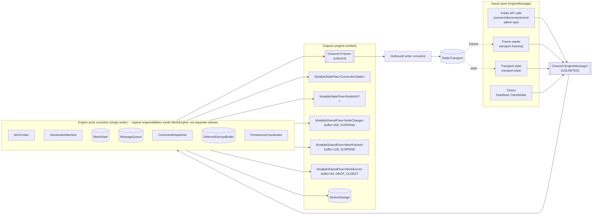

# Engine actor — dataflow

> **Visual companion to [`../decisions/002-architecture.md`](../decisions/002-architecture.md) (Architecture Decision).** This document provides diagrams and dataflow details for the single-writer actor model. For rationale and alternatives, see ADR-002. This is NOT a duplicate — ADR-002 is the decision; this document is the visual reference.

## Component dataflow



**Reading the diagram:**

- The boxes inside the engine subgraph (`WireCodec`, `HandshakeMachine`, `MeshState`, `MessageQueue`, `CommandDispatcher`, `DeferredDecryptBuffer`, `PersistenceCoordinator`) are *logical responsibilities* the single `MeshEngine` class implements; only `WireCodec` ships as a standalone type today (see [`MeshEngine.kt`](../../core/src/commonMain/kotlin/org/meshtastic/sdk/internal/MeshEngine.kt)).
- All four input sources funnel into one inbox. The engine drains it in order.
- The engine never writes to a public flow from anywhere except its own loop. There is no `state.update { … }` from a transport coroutine.
- The outbound writer is a separate coroutine so a slow socket cannot back-pressure the engine itself. The `outbound` channel is `Channel.UNLIMITED` — the engine produces outbound frames synchronously inside its own coroutine and must never suspend on its own output. The transport's `send` is what actually waits.
- `DeviceStorage` writes happen inline on the engine coroutine — they're suspending but serialised. Storage implementations are responsible for not blocking the engine for long; SQLDelight + a background `Dispatchers.IO` write coalescer is the recommended pattern (`storage-sqldelight` provides this).

## Coroutine lifecycle

```mermaid
sequenceDiagram
    autonumber
    participant App as App / host
    participant Client as RadioClient
    participant Sup as SupervisorJob (per-client)
    participant Engine as Engine actor
    participant Reader as Frame reader
    participant Writer as Outbound writer
    participant HB as Heartbeat scheduler
    participant Trans as RadioTransport

    App->>Client: connect()
    Client->>Sup: launch under supervisor
    Sup->>Engine: launch
    Sup->>Reader: launch (collects transport.frames())
    Sup->>Writer: launch (drains outbound channel)
    Sup->>HB: launch (idle until Connected)

    Reader->>Trans: collect()
    Engine->>Trans: connect()
    Trans-->>Engine: TransportState.Connected
    Engine->>Engine: HandshakeMachine drives Stage1/Stage2/Seed
    Engine-->>Client: connectionState = Connected
    Engine->>HB: start 30s ticks (per-transport policy)

    loop steady state
        Trans-->>Reader: Frame
        Reader->>Engine: EngineMessage.FrameRx(Frame)
        Engine->>Engine: decode, mutate state, emit flows
        Engine->>Writer: outbound.send(Frame)
        Writer->>Trans: send(Frame)
        HB->>Engine: EngineMessage.HeartbeatTick
        Engine->>Writer: outbound.send(HeartbeatFrame)
    end

    App->>Client: disconnect()
    Client->>Sup: cancel()
    Sup-->>Engine: cancellation
    Engine->>Engine: finally { resolve handles to Failed(Disconnected); flush storage; close transport }
    Engine-->>Client: connectionState = Disconnected
```

**Notes on the sequence:**

- Steps 4-7 (launch under supervisor) happen synchronously in `connect()`; `connect()` then suspends until step 13 (`Connected` emitted) or throws on terminal handshake failure.
- The reader is the only coroutine that observes `transport.frames()`. Multiple readers would race on framing-resync state.
- Heartbeat policy per `protocol.md` §16: TCP+Serial mandatory, BLE opportunistic (default-on, opt-out via `Builder.disableBleHeartbeat()` — see `SPEC.md` §3.1).
- Cancellation via `Sup.cancel()` is the *only* shutdown path. `disconnect()` calls it; supervisor cancel from the host (e.g., closing scope) calls it; transport-side fatal errors post `EngineMessage.Disconnect(cause)` and the engine itself calls `Sup.cancel()` after emitting `Reconnecting(cause)`.

## Backpressure

The engine is a single-writer actor sitting between an unbounded inbox and a fan-out of bounded shared flows. The contract is:

| Surface | Capacity | Overflow | Rationale |
|---|---|---|---|
| `Channel<EngineMessage>` (engine inbox) | UNLIMITED | n/a | Producers (frame reader, public API calls, timers) must never block on the engine. The engine drains promptly; under load the *consumers* of public flows feel the pressure first. |
| `Channel<Frame>` (outbound writer) | UNLIMITED | n/a | The engine produces outbound frames synchronously inside its own coroutine; backpressuring it would deadlock. The transport's `send` is what actually waits. |
| `nodes: SharedFlow<NodeChange>` | replay snapshot once + extra=256 | SUSPEND | Deltas MUST NOT drop; the snapshot is the consistency anchor. Slow consumers backpressure the engine. If pressure outlasts inbox drain time the engine emits `MeshEvent.PacketsDropped(Packets, n)` and drops the *oldest engine-side queued frame* (see below) rather than blocking the transport reader. |
| `packets: SharedFlow<MeshPacket>` | extra=128 | SUSPEND | Same policy as `nodes`. Chat/text loss is unacceptable. |
| `events: SharedFlow<MeshEvent>` | extra=64 | DROP_OLDEST | Events are advisory; we never block the engine on observability. Drops are themselves observable on the next event after pressure clears (`PacketsDropped(Events, n)`). |
| `connection`, `ownNode` | StateFlow | conflate (newest wins) | Lifecycle and identity are inherently single-value; intermediate states are noise. |

**Engine-side drop rule.** When the inbox grows past a soft threshold (default 1024 messages backed up; configurable internally only) AND the public flows are still full, the engine drops the *oldest* `EngineMessage.FrameRx` and surfaces `MeshEvent.PacketsDropped(Packets, count)`. This converts what would otherwise be silent transport-reader stall into an observable event. Lifecycle messages (`Connect`/`Disconnect`/`TransportStateChanged`/`HandshakeTimeout`) and outbound `Send`/`Admin` messages are never dropped.

**Why `UNLIMITED` for the inbox?** Bounded with SUSPEND would let a slow `events` collector deadlock the entire engine (including admin replies and timers). Bounded with DROP_OLDEST would silently lose `Connect`/`Disconnect`. UNLIMITED + the engine-side drop rule above gives us per-class triage without coupling lifecycle to observability.

## EngineMessage variants

```kotlin
internal sealed interface EngineMessage {
    // Lifecycle
    data class Connect(val deferred: CompletableDeferred<Unit>) : EngineMessage
    data class Disconnect(val cause: MeshtasticException? = null) : EngineMessage

    // Inbound
    data class FrameRx(val frame: Frame) : EngineMessage
    data class TransportStateChanged(val state: TransportState) : EngineMessage

    // Outbound
    data class Send(val packet: MeshPacket, val handleSink: CompletableDeferred<MessageHandle>) : EngineMessage
    data class CancelHandle(val id: MessageId) : EngineMessage

    // Admin
    data class Admin<T>(
        val request: AdminMessage,
        val mapper: (AdminMessage) -> T,
        val timeoutMs: Long,
        val deferred: CompletableDeferred<AdminResult<T>>,
    ) : EngineMessage

    // Timers
    object HeartbeatTick : EngineMessage
    data class HandshakeTimeout(val stage: HandshakeStage) : EngineMessage
    data class AdminTimeout(val requestId: Int) : EngineMessage
}
```

The engine `when`-matches over these. There is no other entry point that mutates state.

## Anti-patterns (rejected by code review)

- **Mutex on `MeshState`.** Banned in the engine package. The actor IS the lock.
- **`launch { … }` inside the engine that mutates state.** Banned. Use `EngineMessage` for any deferred work.
- **`transport.send` directly from a public method.** Banned. Always go through `outbound.send(...)` from the engine.
- **`StateFlow.update { … }` from outside the engine coroutine.** Banned. Public flows are write-only by the engine.

## Related

- ADR-002 — full architecture rationale.
- ADR-005 — public flow contracts (`NodeChange`, backpressure policy).
- `handshake-fsm.md` — what `HandshakeMachine` runs inside this actor.
