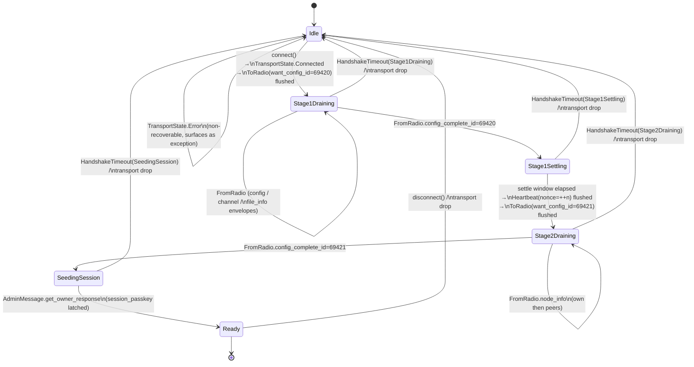

# Handshake FSM

> Visual companion to [`../protocol.md`](../protocol.md) §6 and [`../decisions/002-architecture.md`](../decisions/002-architecture.md). Owned by [`MeshEngine`](../../core/src/commonMain/kotlin/org/meshtastic/sdk/internal/MeshEngine.kt); the stage enum (`HandshakeStage`) lives in [`EngineMessage.kt`](../../core/src/commonMain/kotlin/org/meshtastic/sdk/internal/EngineMessage.kt).

## States

The internal `HandshakeStage` enum has six values; the public `ConnectionState.Configuring` projection uses three `ConfigPhase` values (`Stage1`, `Settling`, `Stage2`).

| `HandshakeStage` | Meaning | Public projection |
|---|---|---|
| `Idle` | No connection attempted, or post-disconnect | `Disconnected` |
| `Stage1Draining` | `want_config_id = SPECIAL_NONCE_ONLY_CONFIG (69420)` posted; receiving the Stage 1 response stream (configs, channels, file_info, **no** nodes) | `Configuring(ConfigPhase.Stage1, p)` |
| `Stage1Settling` | `config_complete_id == 69420` received; settle window elapsing before the inter-stage heartbeat | `Configuring(ConfigPhase.Settling, 0.5f)` |
| `Stage2Draining` | Inter-stage `Heartbeat` flushed and `want_config_id = SPECIAL_NONCE_ONLY_NODES (69421)` posted; receiving Stage 2 (`OWN_NODEINFO` then `OTHER_NODEINFOS`; `FILEMANIFEST` short-circuits to empty) | `Configuring(ConfigPhase.Stage2, p)` |
| `SeedingSession` | Issuing `get_owner_request` to seed `session_passkey` for subsequent admin ops | `Configuring(ConfigPhase.Stage2, 0.95f)` |
| `Ready` | All flows live; heartbeat scheduler started | `Connected` |

Failure causes (`MeshtasticException.HandshakeTimeout`, transport drop, etc.) reset `HandshakeStage` to `Idle`; the engine then projects either `Reconnecting(cause, attempt)` or `Disconnected`. `progress` is monotonically non-decreasing within a single connect attempt, derived from `(received_count / expected_count)` per `protocol.md` §6 envelope counts.

> Note: prior revisions of this doc listed standalone `TransportConnecting`, `Stage1Sending`, `Stage1Settled`, `InterStageHeartbeat`, `Stage2Sending`, and `Failed` states. Those are conceptual milestones inside `MeshEngine` (you can grep `MeshEngine.kt` for `connectionState.value = ConnectionState.Configuring(...)`) — they are not separate `HandshakeStage` enum values.

## Transitions

### Pre-handshake byte discipline (per protocol.md §6)

While in `TransportConnecting` and during the gap between `transport.connect()` returning Connected and `Stage1Sending` posting the first byte, **the engine drops every inbound frame**. Stale `FromRadio` from a prior PhoneAPI session can otherwise corrupt the early state. Once Stage 1's nonce is on the wire, every inbound frame is dispatched.

### Heartbeat in handshake

A heartbeat with `nonce = ++counter` is sent **once** between Stage 1 settle and Stage 2 send. It serves two purposes:

1. Defeats the firmware's per-connection memcmp dedup, ensuring the device treats the upcoming Stage 2 want_config as a fresh request even if the bytes happen to match a recent send.
2. Probes the transport's write path before the larger Stage 2 dump.

The 30 s scheduled heartbeat (`protocol.md` §16) starts only on entry to `Ready`.

## Failure transitions and reconnect

`Failed(cause)` always returns to `Idle`. The engine then runs a fixed reconnect policy: **exponential backoff (initial 500 ms, factor 2, capped at 60 s, with ±20 % jitter), infinite attempts** while the consumer holds the `RadioClient`. Each retry begins a new attempt with `Connecting(attempt + 1)`. The policy is intentionally not configurable in 0.x — Phase 5 may revisit and add `Builder.reconnect(...)` if real-world adopters report concrete needs (recorded as a separate ADR if/when it lands).

Causes that DO NOT auto-reconnect:
- `MeshtasticException.FirmwareTooOld` (firmware build below `MIN_SUPPORTED_FIRMWARE`, surfaced once `metadata` envelope arrives).

Causes that DO auto-reconnect:
- `MeshtasticException.Transport(...)`
- `MeshtasticException.HandshakeTimeout(stage)`
- `MeshtasticException.StorageUnavailable(...)` (single retry; second consecutive failure surfaces and stops)

## Related

- `protocol.md` §6 — wire-level envelope sequence, including the firmware nonce specials (69420/69421).
- ADR-002 — actor model owning this FSM.
- ADR-005 — `ConnectionState` (no `DeviceSleep`); `Reconnecting` carries `cause`.
- `references/meshtastic-android-protocol-notes.md` — 100 ms inter-stage delay precedent.
- `references/meshtastic-apple-protocol-notes.md` — `requiresPeriodicHeartbeat` per-transport.
