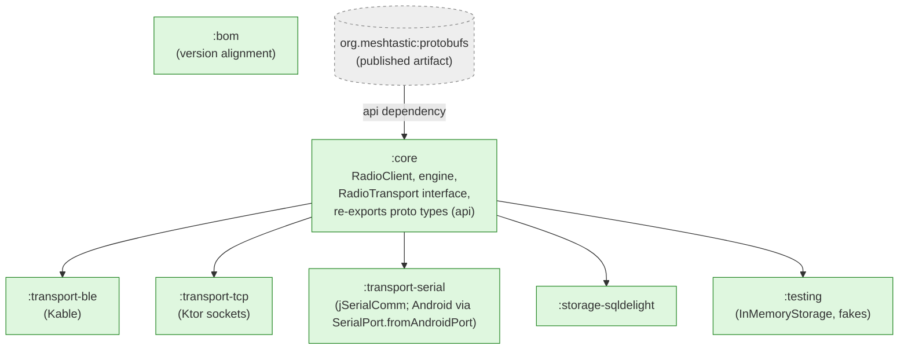
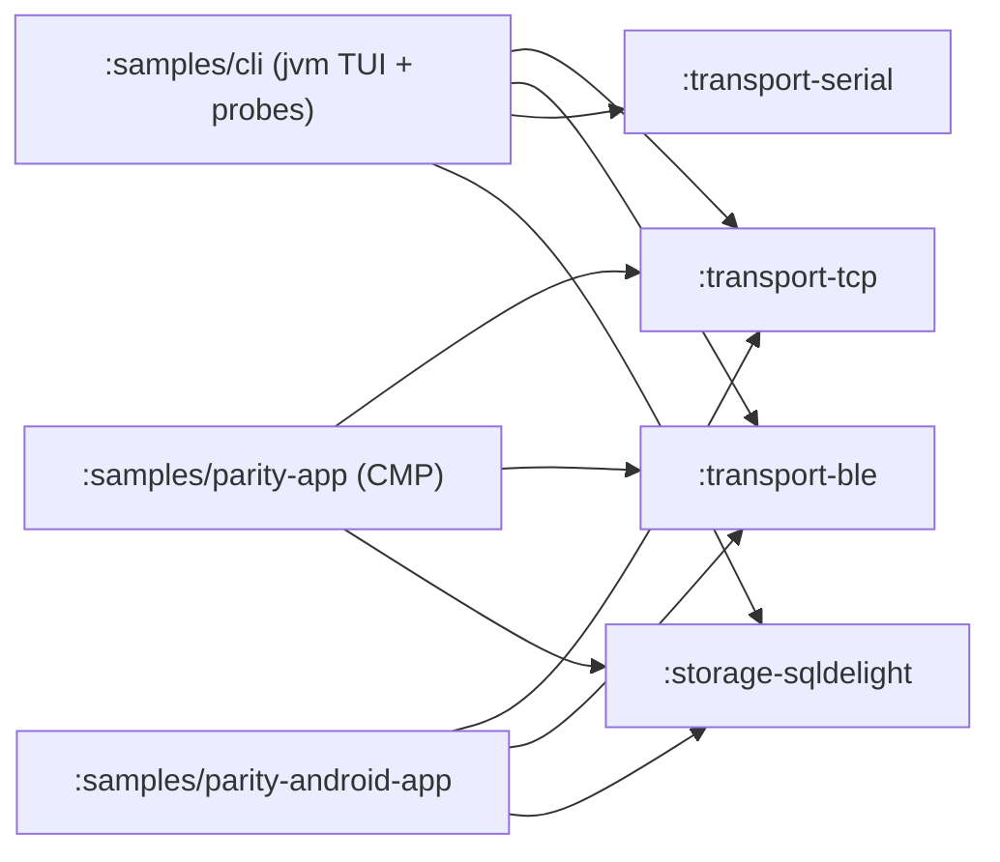
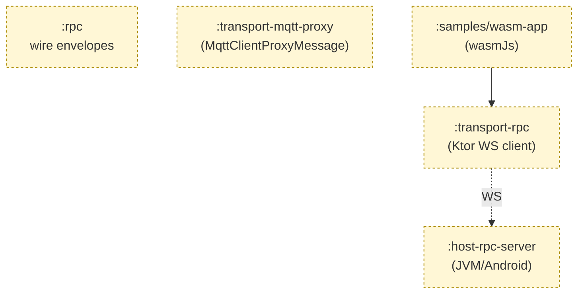

# Module dependency graph

> Visual companion to [`../decisions/006-multi-module-rationale.md`](../decisions/006-multi-module-rationale.md). The graph is enforced by the Gradle build (`:core:verifyModuleBoundary`) and detekt.
>
> **`RadioTransport`, `Frame`, and `TransportIdentity` live in `:core`** (per `SPEC.md` §3.4) — there is no `:transport-api` module. There is also **no `:proto` module**: protobuf types come from the published `org.meshtastic:protobufs` artifact, which `:core` re-exports via `api(...)`. Transport implementation modules depend only on `:core` for both the interface and the wire types (the latter transitively).

## MVP library modules

**Read the arrows as `produces input for`** (i.e., `:core → :transport-ble` means `:transport-ble` depends on `:core`). The wire (proto) types reach every module transitively through `:core`'s `api(org.meshtastic:protobufs)` declaration — only `:core` names the artifact directly.

### Hard rules (Gradle + detekt enforced)

1. `:core` depends only on the published `org.meshtastic:protobufs` artifact — **no in-tree project dependencies** (enforced by `:core:verifyModuleBoundary`). It defines the `RadioTransport` interface itself and re-exports proto types via `api`.
2. Transport modules depend on `:core` (for `RadioTransport` + `Frame` + `TransportIdentity`, plus the wire types transitively). They are wired into a `RadioClient` via `Builder.transport(...)` at construction time.
3. Storage modules depend on `:core` (for `StorageProvider` + `DeviceStorage`, plus the wire types transitively).
4. `:testing` may depend on anything published.
5. `:samples/*` may depend on anything; **nothing depends on `:samples/*`**; samples are not published.
6. `:bom` is a leaf — it lists every published artifact's coordinate but compiles to a Maven BOM only.

## MVP per-target compile matrix

| Module | android | jvm | iosArm64 | iosX64 | iosSimulatorArm64 |
|---|:---:|:---:|:---:|:---:|:---:|
| `:core` | ✓ | ✓ | ✓ | ✓ | ✓ |
| `:transport-ble` | ✓ | ✓ | ✓ | ✓ | ✓ |
| `:transport-tcp` | ✓ | ✓ | ✓ | ✓ | ✓ |
| `:transport-serial` | ✓ | ✓ | stub | stub | stub |
| `:storage-sqldelight` | ✓ | ✓ | ✓ | ✓ | ✓ |
| `:testing` | ✓ | ✓ | ✓ | ✓ | ✓ |
| `:bom` | n/a (Maven BOM only) | | | | |

**iOS posture:** the iOS targets of `:transport-serial` ship as headers/empty actuals only — iOS does not expose USB-serial without an MFi accessory + bespoke framing, so consumers should not attempt `JvmSerialPorts` / `AndroidSerialPorts` on Apple targets. All other transports (BLE, TCP) work on iOS. `:transport-ble` ships a JVM artifact in addition to Android/iOS — Kable's JVM backend powers macOS/Linux/Windows hosts; treat it as best-effort across desktop OSes.
**JVM posture:** BLE is available via `Kable`'s JVM backend (macOS/Linux/Windows); treat as best-effort on desktop OSes (same as line above). Serial uses jSerialComm.
**Android posture:** serial uses usb-serial-for-android via the same `:transport-serial` artifact (single KMP module, two engines wired via expect/actual).

## Sample apps (out of band, not published)

`:samples/cli` is a JVM-only sample exercising all three transports
plus persistent storage from a single JVM entry point with a Mosaic-rendered
TUI dashboard and headless probe sub-commands (`tcpprobe`, `bleprobe`,
`serialprobe`) used as connection-robustness regression harnesses.

`:samples/parity-app` is a Compose Multiplatform reference app targeting
Android and Desktop (JVM). `:samples/parity-android-app` is a minimal
Android-only companion for validating the Android integration path
(permissions, foreground service, lifecycle).

A minimal SwiftUI sample for iOS distribution validation will return in
Phase 5.

Sample-specific scope and acceptance criteria live in [`../samples.md`](../samples.md).

## Roadmap (post-1.0, not in MVP)

The following modules and the `wasmJs` target are tracked separately in [`../future/wasm-rpc-roadmap.md`](../future/wasm-rpc-roadmap.md) and are NOT part of the MVP graph above:

| Module | Targets (planned) | Depends on | Roadmap link |
|---|---|---|---|
| `:rpc` | all incl. `wasmJs` | `org.meshtastic:protobufs` | wasm-rpc-roadmap |
| `:transport-rpc` | all incl. `wasmJs` | `:rpc`, `org.meshtastic:protobufs` (NOT `:core`) | wasm-rpc-roadmap |
| `:host-rpc-server` | jvm, android | `:core`, `:rpc` | wasm-rpc-roadmap |
| `:transport-mqtt-proxy` | android, jvm, ios | `:core`, `org.meshtastic:mqtt-client` | SPEC §6 Phase 6 |
| `wasmJs` source set on `:core` | — | — | wasm-rpc-roadmap |

These do not exist in the MVP graph; they are a destination, not a current state.

## Related

- ADR-006 — module rationale.
- ADR-015 — proto sourcing (the external `org.meshtastic:protobufs` artifact replaces the former in-tree `:proto` module).
- ADR-002 — engine architecture (justifies the `:core` ↔ transport boundary).
- ADR-003 — tooling (justifies which library each transport module wraps).
- `transport-isolation.md` — deep dive on why transports are separate modules, error handling differences, and how to add a new transport.
- `transport-comparison.md` — feature × transport matrix (TCP / BLE / serial), OS support, and selection guidance.
- [`../future/wasm-rpc-roadmap.md`](../future/wasm-rpc-roadmap.md) — post-1.0 wasm + RPC architecture.
