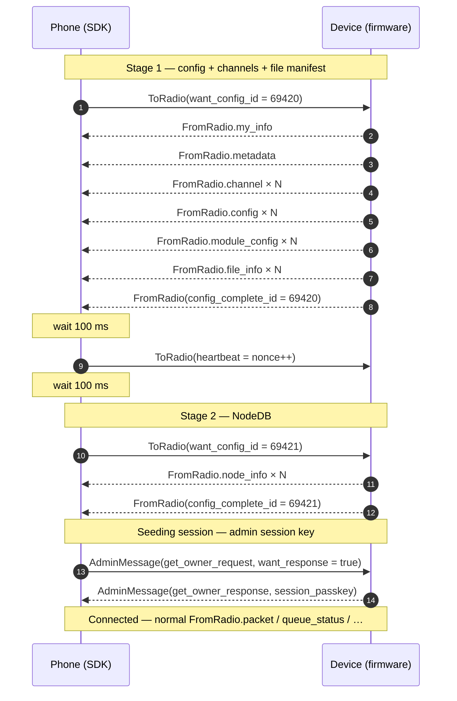

# Meshtastic PhoneAPI — Wire Protocol Reference

> **Canonical, implementer-facing synthesis** of the Meshtastic device PhoneAPI as required to build a clean-room host (phone/desktop) client. This document is the single source of truth that the SDK targets.
>
> **Sources** (all in [`references/`](references/)):
> 1. [`meshtastic/protobufs`](https://github.com/meshtastic/protobufs) — schema (ground truth for message structure)
> 2. [`meshtastic/firmware`](https://github.com/meshtastic/firmware) — device-side reference (ground truth for behavior; **GPL-3.0 — never copy code**)
> 3. [`meshtastic/Meshtastic-Android`](https://github.com/meshtastic/Meshtastic-Android) — Android phone-side reference (**GPL-3.0 — never copy code**)
> 4. [`meshtastic/Meshtastic-Apple`](https://github.com/meshtastic/Meshtastic-Apple) — Apple phone-side reference (**GPL-3.0 — never copy code**)
> 5. [`meshtastic/meshtastic`](https://github.com/meshtastic/meshtastic) — official Docusaurus docs site (https://meshtastic.org) — authoritative human-readable spec (**GPL-3.0 — never copy text**)
>
> When sources conflict, precedence is: **firmware** (behavior) > **protobufs** (structure) > **official docs site** (intent and rationale) > Android/Apple impls. Conflicts are flagged inline.

---

## Table of contents

1. [Transport overview](#1-transport-overview)
2. [Stream framing (TCP & Serial)](#2-stream-framing-tcp--serial)
3. [BLE GATT framing](#3-ble-gatt-framing)
4. [HTTP API framing](#4-http-api-framing)
5. [PhoneAPI envelopes](#5-phoneapi-envelopes-toradio--fromradio)
6. [Handshake state machine](#6-handshake-state-machine)
7. [MeshPacket structure](#7-meshpacket-structure)
8. [PortNums and per-port payloads](#8-portnums--per-port-payloads)
9. [Channel encryption (AES-CTR)](#9-channel-encryption-aes-ctr)
10. [PKI direct messages (X25519 + AES-CCM)](#10-pki-direct-messages-x25519--aes-ccm)
11. [Routing, ACK, retry semantics](#11-routing-ack-retry-semantics)
12. [Outbound queue & send lifecycle](#12-outbound-queue--send-lifecycle)
13. [Admin protocol & session passkey](#13-admin-protocol--session-passkey)
14. [MQTT proxy mode](#14-mqtt-proxy-mode)
15. [Firmware update (XModem)](#15-firmware-update-xmodem)
16. [Heartbeat & queue status](#16-heartbeat--queue-status)
17. [Channels, roles, regions, presets](#17-channels-roles-regions-presets)
18. [Constants & magic numbers](#18-constants--magic-numbers)
19. [Implementation pitfalls (read this)](#19-implementation-pitfalls-read-this)

---

## 1. Transport overview

The PhoneAPI is the wire protocol between a Meshtastic device (radio) and a host (phone, desktop). It runs over **four transport types**, all carrying the same logical stream of `ToRadio` / `FromRadio` protobuf envelopes:

| Transport | Framing | Default endpoint | Notes |
|---|---|---|---|
| **TCP** | 4-byte stream framing (§2) | port **4403** | Single concurrent client per device. **15-minute idle timeout.** (See § 1A for idle semantics.) |
| **Serial** (USB-CDC) | 4-byte stream framing (§2) | 115200 8N1, no flow control | Identical wire format to TCP. Allows clean transition from device debug-text output to protobuf mode on the same port. |
| **BLE** | Native GATT (§3); **no stream framing** | Service `6BA1B218-15A8-461F-9FA8-5DCAE273EAFD` | Each `read()` of `fromradio` returns exactly one `FromRadio` protobuf (or empty when queue drained). Each `write()` to `toradio` carries exactly one `ToRadio`. |
| **HTTP** | Naked protobuf in HTTP body (§4); **no stream framing** | port 80 (HTTP) / 443 (HTTPS) | RESTful: `PUT /api/v1/toradio` and `GET /api/v1/fromradio?all={bool}`. Devices use self-signed certs for HTTPS. |

The host SDK must implement framing per-transport but expose a transport-agnostic `RadioTransport` interface to the upper layers.

### § 1A. TCP idle timeout behavior

The Meshtastic firmware closes any idle TCP connection after **15 minutes** (`900_000 ms`) with no traffic in either direction.

**What "idle" means:**
- A socket is idle if no `FromRadio` or `ToRadio` crosses it.
- Heartbeat traffic (§16) from the firmware counts as activity and resets the idle timer.

**What happens when the timeout fires:**
1. The firmware **closes the TCP socket** on its side.
2. The host SDK detects EOF on `recv()` and transitions to `TransportState.Error(recoverable=true)`.
3. The engine's liveness timeout (§6, typically 2× heartbeat interval) also triggers shortly after.
4. The host **must reconnect** by calling `connect()` again.

**Recovery strategy for hosts:**
- Implement automatic reconnection with exponential backoff (e.g., 1s, 2s, 4s, 8s, max 60s). The SDK does **not** auto-reconnect today; see [`consumer-guides/error-handling.md` → "Reconnect supervisor (consumer-side)"](consumer-guides/error-handling.md#reconnect-supervisor-consumer-side) for a working snippet that observes `connection: StateFlow<ConnectionState>` and re-enters `connect()`.
- Send **heartbeats** to prevent idleness: the SDK does this automatically if the app is receiving mesh traffic; for a quiet link, the app should send a periodic `ToRadio` or rely on the firmware's own heartbeat (via `NodeInfo` ping).
- For interactive use cases (chat apps, UI frontends), the 15-minute timeout is not typically hit because user activity generates traffic.
- For headless/gateway scenarios with low traffic, consider a background heartbeat or explicit keep-alive mechanism.

**Note:** The idle timeout is a device-side setting defined in `firmware:src/mesh/api/ServerAPI.cpp`. It is not configurable from the host SDK and is the same across all transport types.

---

## 2. Stream framing (TCP & Serial)

Used by TCP and Serial transports only. **NOT used by BLE** — BLE relies on GATT's natural message boundaries.

### Frame layout

```
+------+------+----------+----------+==================+
| 0x94 | 0xC3 |   LEN_HI |   LEN_LO |  protobuf bytes  |
+------+------+----------+----------+==================+
   1B     1B       1B         1B          0..512 bytes
```

- **`START1` = `0x94`** (`firmware:src/mesh/StreamAPI.cpp:7`)
- **`START2` = `0xC3`** (`firmware:src/mesh/StreamAPI.cpp:8`)
- **Length** = big-endian uint16 (`high << 8 | low`), counting only the protobuf payload bytes that follow — **does not include** the 4-byte header.
- **Maximum payload** = `MAX_TO_FROM_RADIO_SIZE` = **512 bytes** (`firmware:src/mesh/PhoneAPI.h:13`). Any frame whose declared length exceeds 512 must be discarded and resync started.

### Resync algorithm (mandatory)

The host MUST be tolerant to garbage on the wire, especially on serial (a device may have just emitted boot text). The firmware itself implements a strict resync state machine; the host SDK must do the same on the receive side.

```
state := SCAN_FOR_START1
loop on each received byte b:
  case state:
    SCAN_FOR_START1:
      if b == 0x94: state := EXPECT_START2
    EXPECT_START2:
      if b == 0xC3: state := READ_LEN_HI
      else if b == 0x94: state := EXPECT_START2  // double-94 still valid
      else:               state := SCAN_FOR_START1
    READ_LEN_HI:
      hi := b; state := READ_LEN_LO
    READ_LEN_LO:
      len := (hi << 8) | b
      if len > 512:
        state := SCAN_FOR_START1  // bogus length, resume scanning
      else:
        bytesRemaining := len; state := READ_PAYLOAD
    READ_PAYLOAD:
      append b to buffer
      if buffer.size == len:
        try parse FromRadio from buffer
          on success: emit FromRadio; clear; state := SCAN_FOR_START1
          on failure: log warning; clear; state := SCAN_FOR_START1
```

> **Pitfall**: a corrupt length byte can swallow up to 512 subsequent bytes before the next resync attempt. Property-test your codec with random byte streams to confirm bounded recovery.

### Wake bytes (reconnect hygiene, stream transports only)

On TCP and serial connect, host implementations SHOULD write 4 × `0x94` (`START1`) bytes immediately after the link comes up and before the first `ToRadio.want_config_id`. These are valid no-ops for a healthy firmware framer (the resync FSM stays in `EXPECT_START2` on repeated `START1`) and corrective for a framer left mid-frame by an unclean previous disconnect — which would otherwise burn most of the Stage 1 timeout (§6) chasing a phantom payload length.

Matches the Meshtastic-Android reference (`StreamFrameCodec.WAKE_BYTES`). BLE has no stream framing (§3) and does not need this.

### Encode side

```
emit 0x94, 0xC3, (payload.size >> 8) & 0xFF, payload.size & 0xFF, ...payload
```

If `payload.size > 512`, the SDK must reject the message with a programmer error; do not split.

---

## 3. BLE GATT framing

BLE uses GATT message boundaries directly. The phone subscribes to a notification characteristic and drains a read characteristic until empty.

### Service & characteristics (cross-validated firmware ↔ Apple)

| Role | UUID | Properties |
|---|---|---|
| **Mesh service** | `6BA1B218-15A8-461F-9FA8-5DCAE273EAFD` | — |
| `fromradio` | `2C55E69E-4993-11ED-B878-0242AC120002` | **READ** — returns one `FromRadio` protobuf per read; empty read means queue drained |
| `toradio` | `F75C76D2-129E-4DAD-A1DD-7866124401E7` | **WRITE** (acknowledged) — phone writes one `ToRadio` protobuf per write. Firmware declares `CHR_PROPS_WRITE` only (NRF52Bluetooth.cpp; NimBLE equivalent): write-without-response is NOT in the characteristic properties and strict stacks (Android/Kable) refuse it — verified against real radios. |
| `fromnum` | `ED9DA18C-A800-4F66-A670-AA7547E34453` | **NOTIFY** + **READ** — 4-byte little-endian counter that increments whenever the device pushes data into the `fromradio` queue |
| `logradio` (optional, current) | `5A3D6E49-06E6-4423-9944-E9DE8CDF9547` | **NOTIFY** + **READ** — streaming device log lines; informational only. Primary on current firmware. |
| `logradio` (optional, legacy) | `6C6FD238-78FA-436B-AACF-15C5BE1EF2E2` | **NOTIFY** + **READ** — legacy log characteristic. Kept by firmware for backward compatibility; clients should subscribe to whichever is advertised. |

Also exposed: standard Bluetooth Battery Service `0x180F` with characteristic `0x2A19`.

### The drain protocol (CRITICAL)

```
on connect:
  subscribe to fromnum (notify)
  subscribe to fromradio (notify)  // some firmware variants notify here too
  trigger initial drain

on fromnum notification (or any wake signal):
  if isDraining: set needsRedrain := true; return
  isDraining := true
  loop:
    bytes := read(fromradio)
    if bytes.isEmpty(): break    // queue exhausted
    parse bytes as FromRadio; deliver to upper layer
  isDraining := false
  if needsRedrain: needsRedrain := false; goto drain entry
```

> **Pitfall**: do not treat `fromnum`'s value as a "messages waiting" count. It's just an ever-increasing wake signal. Always drain by reading until empty.

> **Pitfall (during config)**: while the device is in any `STATE_SEND_*` state other than `STATE_SEND_PACKETS`, an empty read **blocks** on some firmware variants — the device intentionally waits to push the next config message rather than returning empty. Phones see this as natural backpressure; do not poll-spin.

### MTU

- Device requests MTU **517** on ESP32-S3 / C6 (allows 512-byte payload + ATT overhead).
- Default fallback if negotiation fails: **23** (BLE minimum).
- The host should not assume any specific MTU; use `maximumWriteValueLength(WITHOUT_RESPONSE)` (Android Kable) or CoreBluetooth's per-write limit (iOS) to determine actual write capacity. Each `toradio` write must fit within the negotiated MTU.

### Bonding / pairing

- **Numeric comparison** (6-digit PIN). Device shows the PIN on its display (if it has one) and logs it.
- Optionally: `config.bluetooth.fixed_pin` for a static PIN.
- Pairing/bonding is **OS-managed** (Android Settings, iOS Settings). The SDK should not attempt to drive bonding directly; surface bonding-required errors to the host app.
- NRF52 platforms use legacy classic BLE pairing via `NRF52Bluetooth.cpp`; ESP32 platforms use NimBLE.

---

## 4. HTTP API framing

ESP32-based devices with WiFi (or Ethernet) expose a REST API used by browser-based clients (e.g., the official web client at `client.meshtastic.org`). Each request carries exactly one envelope as a binary protobuf body — **no `0x94 0xC3` stream framing**.

### Endpoints

| Method | Path | Body | Response |
|---|---|---|---|
| `PUT` | `/api/v1/toradio` | One `ToRadio` protobuf, binary | `204 No Content` on success |
| `GET` | `/api/v1/fromradio` | (none) | One `FromRadio` protobuf, binary; empty body when queue drained |
| `GET` | `/api/v1/fromradio?all=true` | (none) | Concatenation of all queued `FromRadio` protobufs; the host parses sequentially using protobuf length-delimited semantics or by stopping at end-of-body |
| `OPTIONS` | `/api/v1/toradio` | (none) | `204 No Content` (CORS / connection validation) |

### Content type

- Request and response `Content-Type: application/x-protobuf`.
- Optional response header `X-Protobuf-Schema` may carry a URI to the schema for documentation / discovery.

### Transport

- HTTP on port **80**, HTTPS on port **443**. Devices serve their own **self-signed certificate**; browsers require manual trust. The hosted web client at `client.meshtastic.org` is HTTPS-only and so requires the device's HTTPS endpoint be trusted out-of-band.
- **No authentication** — trust is established by network access. SDK consumers exposing a device over public networks must add their own gateway-level auth.
- The HTTP API is **stateless from the device's perspective**: there is no equivalent of TCP's "single concurrent connection" lock; multiple GET pollers can share a queue (though each `FromRadio` is consumed once).

### Polling pattern

The SDK polls `GET /api/v1/fromradio?all=true` periodically (typically 1–5 seconds depending on UI responsiveness needs). The empty body sentinel signals "queue drained, no need to re-poll until next user action or wakeup." Future firmware revisions are expected to add a `chunked=true` long-polling mode (per docs).

### Reference implementation

`meshtastic.js` (https://github.com/meshtastic/js) is the canonical TypeScript client. An equivalent Kotlin transport implementation belongs in a future `transport-http` module (see [`./future/wasm-rpc-roadmap.md`](./future/wasm-rpc-roadmap.md)), not in `transport-tcp` — the framing is fundamentally different.

> **Pitfall**: Do NOT prepend `0x94 0xC3` headers to HTTP bodies. The HTTP transport is the only PhoneAPI transport that carries a *raw* protobuf, with no length prefix at all (HTTP `Content-Length` does that job).

---

## 5. PhoneAPI envelopes (`ToRadio` / `FromRadio`)

All transports carry exactly one `FromRadio` per inbound message and one `ToRadio` per outbound message. These are oneof-based protobuf wrappers defined in `mesh.proto`.

### `ToRadio` (phone → device)

```protobuf
message ToRadio {
  oneof payload_variant {
    MeshPacket packet              = 1;  // App-layer outbound packet (text, position, telemetry, admin, etc.)
    uint32     want_config_id      = 3;  // Triggers the config handshake (see §6)
    bool       disconnect          = 4;  // Phone politely tells device it is dropping the link
    XModem     xmodem_packet       = 5;  // Firmware update transfer (see §15)
    MqttClientProxyMessage mqtt_client_proxy_message = 6;  // (see §14)
    Heartbeat  heartbeat           = 7;  // Liveness ping (see §16)
  }
}
```

### `FromRadio` (device → phone)

```protobuf
message FromRadio {
  uint32 id = 1;  // Sequential per-session
  oneof payload_variant {
    MeshPacket  packet                  = 2;  // App-layer inbound packet
    MyNodeInfo  my_info                 = 3;  // Phone's view of THIS node (config handshake)
    NodeInfo    node_info               = 4;  // Other-node info from NodeDB (config handshake)
    Config      config                  = 5;  // Config sub-message (config handshake)
    LogRecord   log_record              = 6;  // (legacy text log)
    uint32      config_complete_id      = 7;  // Terminator: handshake complete (echoes want_config_id)
    bool        rebooted                = 8;  // Device booted; treat as forced disconnect
    ModuleConfig module_config          = 9;  // ModuleConfig sub-message (config handshake)
    Channel     channel                 = 10; // Channel definition (config handshake)
    QueueStatus queue_status            = 11; // Outbound queue accounting (see §12, §16)
    XModem      xmodem_packet           = 12; // Firmware update transfer (see §15)
    DeviceMetadata metadata             = 13; // Firmware version, hw model, role, hasPKC, etc. (config handshake)
    MqttClientProxyMessage mqtt_client_proxy_message = 14; // (see §14)
    FileInfo    file_info               = 15; // File system manifest entry (config handshake)
    ClientNotification client_notification = 16; // User-facing notification
    DeviceUIConfig device_ui            = 17; // UI customization payload
  }
}
```

> The `id` field on `FromRadio` is a per-session counter from the device, useful for ordering / dedupe but the SDK should not depend on it for correlation — use `MeshPacket.id` for app-level packet correlation.

---

## 6. Handshake state machine

Every fresh transport connection MUST begin with a **two-stage** configuration handshake. Stage 1 streams configs/module-configs/channels (and the file manifest); the phone then sends a heartbeat to settle the device and begins Stage 2, which streams the NodeDB. Both stages are framed by a `want_config_id` nonce echoed back in `config_complete_id` as a sentinel. Cross-validated against `Meshtastic-Android` (`HandshakeStateMachine`, `HeartbeatSender`) and `Meshtastic-Apple` (`BLEManager.discoverConfig`).

### Trigger

Phone sends:

```
ToRadio(want_config_id = N)
```

where `N` is a uint32 nonce. The firmware does NOT require randomness — only that the value matches what comes back in `config_complete_id`.

#### Well-known nonces (used by both reference clients)

| Nonce | Constant | Behavior |
|---|---|---|
| **`69420`** | `SPECIAL_NONCE_ONLY_CONFIG` (Android `CONFIG_NONCE`) | **Stage 1.** Stream MyInfo, metadata, configs, module-configs, channels, file manifest; **skip the NodeDB**. |
| **`69421`** | `SPECIAL_NONCE_ONLY_NODES` (Android `NODE_INFO_NONCE`) | **Stage 2.** Stream the NodeDB only. |
| Any other non-zero | (legacy single-stage) | Full config + NodeDB stream. New SDK code SHOULD use the two-stage flow. |
| `0` | — | Phones MUST NOT send `0`. |

### Two-stage flow (canonical)

```
Phone → ToRadio(want_config_id = 69420)              ── Stage 1 begin
Device → FromRadio.my_info / metadata / channel × N
        / config × N / module_config × N
        / file_info × N
        / config_complete_id = 69420                  ── Stage 1 end

Phone:  wait 100 ms
Phone → ToRadio(heartbeat = Heartbeat(nonce = ++n))   ── pre-handshake heartbeat (settle)
Phone:  wait 100 ms

Phone → ToRadio(want_config_id = 69421)              ── Stage 2 begin
Device → FromRadio.node_info × N
        / config_complete_id = 69421                  ── Stage 2 end (Connected)

Phone → AdminMessage(get_owner_request, want_response = true)
Device → AdminMessage(get_owner_response, session_passkey = …)   ── seed session key
```

After Stage 2 completes the link is `Connected`; subsequent `FromRadio` traffic is normal operation (`packet`, `queue_status`, `mqtt_client_proxy_message`, etc.).




### Stage 1 device response sequence

The firmware emits these `FromRadio` payloads in this order (`firmware:src/mesh/PhoneAPI.cpp:213-223`); item 8 (NodeDB) is **skipped** under nonce `69420 = SPECIAL_NONCE_ONLY_CONFIG` and item 9 (FILEMANIFEST) is *short-circuited to empty* under `69421 = SPECIAL_NONCE_ONLY_NODES`:

| # | State | `FromRadio` variant | Notes |
|---|---|---|---|
| 1 | `STATE_SEND_MY_INFO` | `my_info: MyNodeInfo` | Mandatory. Sets phone's view of `my_node_num`. |
| 2 | `STATE_SEND_UIDATA` | `device_ui: DeviceUIConfig` | Optional UI payload. |
| 3 | `STATE_SEND_OWN_NODEINFO` | `node_info: NodeInfo` | Self entry in NodeDB. |
| 4 | `STATE_SEND_METADATA` | `metadata: DeviceMetadata` | Firmware version, hw model, role, `hasPKC` (PKI capability), excluded modules. |
| 5 | `STATE_SEND_CHANNELS` | `channel: Channel` × N | One per defined channel slot. |
| 6 | `STATE_SEND_CONFIG` | `config: Config` × N | One per Config sub-message: device, position, power, network, display, lora, bluetooth, security, sessionkey, device_ui. |
| 7 | `STATE_SEND_MODULECONFIG` | `module_config: ModuleConfig` × N | One per ModuleConfig sub-message: mqtt, serial, external_notification, store_forward, range_test, telemetry, canned_message, audio, remote_hardware, neighbor_info, detection_sensor, ambient_lighting, paxcounter, traffic_management. |
| 8 | `STATE_SEND_OTHER_NODEINFOS` | `node_info: NodeInfo` × N | **Skipped under nonce 69420.** Under `69421` the firmware jumps directly here from `STATE_SEND_OWN_NODEINFO` (skipping rows 4–7). |
| 9 | `STATE_SEND_FILEMANIFEST` | `file_info: FileInfo` × N | File-system manifest. Emitted only under `69420` (and any non-special nonce); short-circuited to empty under `69421` (`PhoneAPI.cpp` line 522). |
| 10 | `STATE_SEND_COMPLETE_ID` | `config_complete_id = N` | **Sentinel** — current stage done; value MUST equal the nonce the phone sent. |
| 11 | `STATE_SEND_PACKETS` | `packet: MeshPacket`, `queue_status`, `mqtt_client_proxy_message`, etc. | Normal operation (after Stage 2). |

> **Upstream contract.** `firmware:src/mesh/PhoneAPI.cpp getFromRadio()` tags this
> exact sequence with the verbatim comment *"the client apps ASSUME THIS SEQUENCE,
> DO NOT CHANGE IT."* Treat the order as a hard-locked wire contract: any host
> implementing this handshake MUST accept these variants in this order and MUST
> NOT gate Stage-1 completion on later variants arriving before earlier ones.

**Stage 2 sequence (under `69421`):** rows 1–3 (`MY_INFO`, `UIDATA`, `OWN_NODEINFO`) → row 8 (`OTHER_NODEINFOS` × N) → row 10 (`COMPLETE_ID = 69421`). Rows 4–7 (metadata, channels, configs, module configs) and row 9 (file manifest) are skipped. Configuration data is therefore Stage-1-only; node DB is Stage-2-only.

### Host-side rules

1. The phone MUST consider itself **`Configuring`** until `config_complete_id == 69421` (or matching sentinel for the legacy single-stage flow). It MAY surface configs/channels/nodes as they stream in, but MUST NOT consider itself `Connected` until Stage 2 ends.
2. **Pre-handshake bytes are discarded.** Any `FromRadio` received before the matching `config_complete_id` for the *current* stage is dropped from the public surface (may be logged). This rule applies to all transports — BLE-only "drain stale buffer" hacks are not needed; the transport-agnostic invariant is "discard until matching sentinel".
3. **Inter-stage settle.** Between Stage 1 sentinel and Stage 2 trigger the phone MUST send `ToRadio.heartbeat` and SHOULD wait ~100 ms either side of it (Android: `HandshakeStateMachine` lines 187–222 — `delay(100); heartbeatSender.send(); delay(100)`). This lets the device's task queue drain before NodeDB streaming starts.
4. **Session passkey seeding.** Immediately after Stage 2 completes, the phone SHOULD issue an `AdminMessage(get_owner_request, want_response = true)`. The response carries `session_passkey` which is required for all subsequent state-changing admin requests (§13).
5. If the device emits `FromRadio.rebooted = true`, treat as a forced disconnect — clear all state and re-issue Stage 1 with a fresh nonce pair (`69420` then `69421`).
6. On TCP/Serial close, the device resets its `config_nonce` to `0` and clears all session state. On reconnection, both stages are mandatory.
7. While the device is mid-handshake, queued outbound packets in the device router are NOT dropped — they will be sent after `config_complete_id`. However, the device WILL drop incoming `MqttClientProxyMessage` from the phone during handshake with a warning log.

### Generating the nonce

For the canonical two-stage flow use the well-known nonces `69420` / `69421`. For diagnostic / legacy single-stage handshakes a random non-zero uint32 per cycle keeps logs unambiguous; randomness is not a protocol requirement.

---

## 7. MeshPacket structure

The `MeshPacket` is the unit of mesh-network traffic. Every app-layer event (text, position, telemetry, admin, ack, etc.) is a `MeshPacket` with a payload identified by `PortNum`.

```protobuf
message MeshPacket {
  fixed32 from           = 1;  // Sending node ID (uint32)
  fixed32 to             = 2;  // Destination node ID; 0xFFFFFFFF = broadcast
  uint32  channel        = 3;  // Channel index (0 = primary)
  oneof payload_variant {
    Data  decoded        = 4;  // Decrypted payload (only present after channel decryption)
    bytes encrypted      = 5;  // Ciphertext (always present on-air; phone-side may decrypt to `decoded`)
  }
  fixed32 id             = 6;  // Packet ID (uint32). Generated by sender. Used for ACK correlation, dedupe.
  fixed32 rx_time        = 7;  // Receiver-side wall-clock seconds since UNIX epoch (set by device)
  float   rx_snr         = 8;  // Received SNR
  uint32  hop_limit      = 9;  // Decremented at each relay; max 7 (HOP_LIMIT_MAX)
  bool    want_ack       = 10; // Sender wants explicit ACK from destination via Routing app
  Priority priority      = 11; // BACKGROUND/DEFAULT/RELIABLE/ACK/MAX/HIGH (see enum)
  uint32  rx_rssi        = 12; // Received RSSI
  uint32  via_mqtt       = 13; // 1 if received via MQTT proxy (ServiceEnvelope) rather than airwaves
  uint32  hop_start      = 14; // Original hop_limit at send time. (hop_start - hop_limit) = hops_away
  bytes   public_key     = 15; // (PKI) Sender's 32-byte X25519 public key, if PKI used
  bool    pki_encrypted  = 16; // True if `encrypted` is PKI-encrypted (X25519+AES-CCM, see §10)
  fixed32 next_hop       = 17; // Next-hop node ID (uint32) for unicast routing hint
  fixed32 relay_node     = 18; // The node that relayed this to me (uint32)
  uint32  tx_after       = 19; // Transmit-after delay (seconds), used by router for backoff
  Delayed delayed        = 20; // Whether this is a delayed/store-and-forward packet
  TransportMechanism transport = 21; // How this packet arrived (LoRa, MQTT, API, etc.)
}

enum Priority {
  UNSET      = 0;
  MIN        = 1;
  BACKGROUND = 10;
  DEFAULT    = 64;
  RELIABLE   = 70;
  RESPONSE   = 80;
  HIGH       = 100;
  ALERT      = 110;
  ACK        = 120;
  MAX        = 127;
}
```

### Constants
- **`HOP_LIMIT_MAX` = 7** (3-bit field; max useful hop_limit)
- **Broadcast address: `0xFFFFFFFF`** (NOT `0` and NOT `0xFF`)
- **`PublicKey` size: always 32 bytes** (Curve25519)

### Payload paths

- **Outbound from phone**: phone constructs `MeshPacket` with `decoded: Data{...}` populated, sets `id`, `to`, `channel`, etc., wraps in `ToRadio.packet`, sends. Device encrypts (if channel has PSK) or PKI-encrypts (if direct message and recipient has known public key) before air transmission.
- **Inbound to phone**: device hands phone a `MeshPacket` with EITHER `decoded` (already-decrypted by the device — both channel PSK and PKI direct messages are decrypted on-device using `CryptoEngine.cpp`'s `decryptCurve25519` / channel-PSK paths) OR `encrypted` (phone must decrypt — only the case when the phone holds a channel PSK that the device does not have configured locally; PKI keypairs live on the device, not the phone).

> **Pitfall**: a `MeshPacket.id` of `0` is invalid for outbound packets. The device assigns the ID if the phone leaves it `0`, but for ACK correlation the phone usually generates the ID itself.

---

## 8. PortNums & per-port payloads

`PortNum` (defined in `portnums.proto`) routes the bytes inside `Data.payload` to the correct decoder.

```protobuf
message Data {
  PortNum portnum        = 1;   // Routes payload interpretation
  bytes   payload        = 2;   // Raw bytes (interpretation depends on portnum)
  bool    want_response  = 3;   // Recipient should reply if possible (use sparingly on broadcast)
  fixed32 dest           = 4;   // [INTERNAL] Multihop destination
  fixed32 source         = 5;   // [INTERNAL] Multihop source
  fixed32 request_id     = 6;   // [ROUTING] Echoed by routing failure responses; correlates ACKs
  fixed32 reply_id       = 7;   // [REPLY] If non-zero, this is a reply to the packet with this id
  fixed32 emoji          = 8;   // [REACTION] Emoji reaction code
  uint32  bitfield       = 9;   // Misc bit flags
}
```

### PortNum table (most common)

| PortNum | Value | Payload type | Direction | Notes |
|---|---|---|---|---|
| `UNKNOWN_APP` | 0 | — | — | Unset/error |
| `TEXT_MESSAGE_APP` | 1 | UTF-8 string in `payload` | both | Plain chat |
| `REMOTE_HARDWARE_APP` | 2 | `HardwareMessage` | both | Remote GPIO |
| `POSITION_APP` | 3 | `Position` | both | Lat/lon/alt/precision/time |
| `NODEINFO_APP` | 4 | `User` | both | Long/short name, public_key, role, is_licensed |
| `ROUTING_APP` | 5 | `Routing` | both | ACK/NAK and route discovery |
| `ADMIN_APP` | 6 | `AdminMessage` | both | Device administration (see §13) |
| `TEXT_MESSAGE_COMPRESSED_APP` | 7 | `unishox2`-compressed UTF-8 | both | Optional compression |
| `WAYPOINT_APP` | 8 | `Waypoint` | both | Shared map markers |
| `AUDIO_APP` | 9 | Codec2 audio frames | both | Push-to-talk |
| `DETECTION_SENSOR_APP` | 10 | UTF-8 string | device→phone | GPIO event notifications |
| `ALERT_APP` | 11 | UTF-8 string | both | High-priority broadcast alerts |
| `KEY_VERIFICATION_APP` | 12 | `KeyVerification` | both | PKI fingerprint verification (see §10) |
| `REMOTE_SHELL_APP` | 13 | UTF-8 bytes | both | Remote shell module (admin gated) |
| `REPLY_APP` | 32 | `payload` is text/emoji reply | both | Modern reply channel |
| `IP_TUNNEL_APP` | 33 | IP packet bytes | both | Optional IP-over-LoRa |
| `PAXCOUNTER_APP` | 34 | `Paxcount` | device→phone | Pedestrian counter |
| `STORE_FORWARD_PLUSPLUS_APP` | 35 | `StoreAndForward` (extended) | both | Store-and-forward v2 |
| `NODE_STATUS_APP` | 36 | proprietary | — | Reserved |
| `SERIAL_APP` | 64 | UTF-8 / bytes | both | Serial-bridge module |
| `STORE_FORWARD_APP` | 65 | `StoreAndForward` | both | Store-and-forward router |
| `RANGE_TEST_APP` | 66 | UTF-8 sequence numbers | both | Range testing module |
| `TELEMETRY_APP` | 67 | `Telemetry` | both | DeviceMetrics / EnvironmentMetrics / etc. |
| `ZPS_APP` | 68 | proprietary | — | Reserved |
| `SIMULATOR_APP` | 69 | proprietary | — | Reserved |
| `TRACEROUTE_APP` | 70 | `RouteDiscovery` | both | Route trace |
| `NEIGHBORINFO_APP` | 71 | `NeighborInfo` | both | Neighbor heartbeat |
| `ATAK_PLUGIN` | 72 | `TAKPacket` | both | ATAK integration |
| `MAP_REPORT_APP` | 73 | `MapReport` | device→MQTT | Public map reporting |
| `POWERSTRESS_APP` | 74 | proprietary | — | Power stress test |
| `LORAWAN_BRIDGE` | 75 | proprietary | — | LoRaWAN bridge module |
| `RETICULUM_TUNNEL_APP` | 76 | Reticulum bytes | both | Reticulum integration |
| `CAYENNE_APP` | 77 | bytes | — | LoRaWAN Cayenne payload |
| `ATAK_PLUGIN_V2` | 78 | `TAKPacket` (v2) | both | ATAK integration v2 |
| `GROUPALARM_APP` | 112 | proprietary | — | Group alarm module |
| `PRIVATE_APP` | 256 | bytes | — | Reserved for private use |
| `ATAK_FORWARDER` | 257 | bytes | — | ATAK forwarding |
| `MAX` | 511 | sentinel | — | Max valid PortNum |

> Phone-app payloads are all defined in `meshtastic/protobufs` (`telemetry.proto`, `mesh.proto`, `admin.proto`, etc.). The SDK uses Wire to generate Kotlin DTOs for all of them; consumers see typed payloads.

### `Routing` payload (PortNum 5)

```protobuf
message Routing {
  oneof variant {
    RouteDiscovery route_request = 1;   // Traceroute outbound
    RouteDiscovery route_reply   = 2;   // Traceroute response
    Error          error_reason  = 3;   // ACK/NAK; 0 = NONE = ACK
  }
}
enum Error {
  NONE = 0;                    // Success / ACK
  NO_ROUTE = 1;
  GOT_NAK = 2;
  TIMEOUT = 3;
  NO_INTERFACE = 4;
  MAX_RETRANSMIT = 5;
  NO_CHANNEL = 6;
  TOO_LARGE = 7;
  NO_RESPONSE = 8;
  DUTY_CYCLE_LIMIT = 9;
  BAD_REQUEST = 32;
  NOT_AUTHORIZED = 33;
  PKI_FAILED = 34;
  PKI_UNKNOWN_PUBKEY = 35;
  ADMIN_BAD_SESSION_KEY = 36;
  ADMIN_PUBLIC_KEY_UNAUTHORIZED = 37;
  RATE_LIMIT_EXCEEDED = 38;
}
```

Routing packets carry their `request_id` field referencing the original packet's `id` — that is how the SDK correlates ACKs/NAKs to outbound sends.

---

## 9. Channel encryption (AES-CTR)

Channels provide symmetric encryption with a pre-shared key (PSK). All nodes on a channel share the PSK; any node can decrypt any traffic.

### Channel structure

```protobuf
message Channel {
  int32 index = 1;
  ChannelSettings settings = 2;
  Role role = 3;       // DISABLED / PRIMARY / SECONDARY
}

message ChannelSettings {
  bytes psk = 1;       // 0/1/16/32 bytes (see PSK shorthand below)
  string name = 2;     // Human-readable channel name
  fixed32 id = 3;      // Numeric ID (channel hash; see below)
  bool uplink_enabled = 4;
  bool downlink_enabled = 5;
  ModuleSettings module_settings = 6;
}
```

### PSK shorthand (CRITICAL — easy to get wrong)

The `psk` bytes field is interpreted by length:

| `psk.size` | Meaning |
|---|---|
| **0** | No encryption — ciphertext on the wire equals plaintext. |
| **1**, value `0x00` | No encryption (alternative encoding). |
| **1**, value `0x01` | **Default channel key**: `{0xd4, 0xf1, 0xbb, 0x3a, 0x20, 0x29, 0x07, 0x59, 0xf0, 0xbc, 0xff, 0xab, 0xcf, 0x4e, 0x69, 0x01}` (16 bytes; AES-128). This is the well-known LongFast/MediumFast default. Index `1` is also a no-op offset over itself (see next row). |
| **1**, value `pskIndex` (`0x02..`) | "Simple" preset: same as default key but with the **last byte replaced by `defaultPsk[15] + (pskIndex - 1)`** (`firmware:src/mesh/Channels.cpp` lines 228–242). So `[0x02]` → last byte `0x02`, `[0x03]` → `0x03`, …, `[0x0A]` → `0x0A`. Firmware imposes no upper bound (the offset is `uint8_t` and wraps), but the reference clients expose this as `simple1`..`simple9` mapped to pskIndex `2`..`10` (the canonical UI range — not a wire requirement). |
| **16** | AES-128 key, used as-is. |
| **32** | AES-256 key, used as-is. |
| Other lengths | Invalid; must be rejected. |

### Channel hash (used by device to filter incoming packets)

The 8-bit channel hash is computed as:

```
hash := xorBytes(channel.name.utf8) ^ xorBytes(channel.psk)
where xorBytes(bytes) := bytes.fold(0) { acc, b -> acc ^ b }
```

This hash is stored in `MeshPacket.channel` for outbound packets so receivers can quickly skip packets they cannot decrypt. The SDK must compute and provide this hash when constructing outbound packets.

> Source: `firmware:src/mesh/Channels.cpp:27-51` (`generateHash` and `xorHash`).

### Encryption: AES-CTR

```
algorithm := AES-256-CTR  if psk.size == 32
algorithm := AES-128-CTR  if psk.size == 16 (or expanded 1-byte shorthand)
algorithm := none         if psk.size == 0 or psk == [0x00]

key   := the (possibly expanded) 16- or 32-byte PSK
nonce := 16 bytes:
  bytes 0..7   : packet_id   (uint64 little-endian — pad uint32 packet_id with leading zeros)
  bytes 8..11  : from_node   (uint32 little-endian)
  bytes 12..15 : 0x00 0x00 0x00 0x00

ciphertext := AES-CTR(key, nonce).process(plaintext)
```

The plaintext is the **serialized `Data` protobuf** (i.e. the inner message that lives in `MeshPacket.decoded`). The ciphertext goes into `MeshPacket.encrypted`.

> **Pitfall (cross-source conflict resolved)**: an older Android-side note suggested the IV is uint32 packet_id zero-padded. **This is incorrect.** The firmware (`src/mesh/CryptoEngine.cpp:287-296` `initNonce`) treats the first 8 bytes as `packet_id` interpreted as uint64. For uint32 packet_ids this means: write the 32-bit packet_id as little-endian into bytes 0..3, then zeros in bytes 4..7. Trust the firmware.

> **Pitfall**: AES-CTR provides no authentication. A malicious actor with the PSK can produce undetectable forgeries. This is by-design for channel traffic (anyone with the PSK is trusted). For authenticated direct messages, use PKI (§10).

---

## 10. PKI direct messages (X25519 + AES-CCM)

For unicast messages between two nodes that have exchanged Curve25519 public keys, the device can use authenticated encryption instead of channel PSK.

### Trigger conditions

A `MeshPacket` is PKI-encrypted (rather than channel-encrypted) when ALL of:
- `to` is unicast (not `0xFFFFFFFF`)
- The sender knows the recipient's `public_key` (from a prior `NODEINFO_APP` packet)
- The recipient is signaled by setting `MeshPacket.pki_encrypted = true` on the wire

### Cryptography

```
sender_priv      := local 32-byte X25519 private key (host-managed; persisted securely)
recipient_pub    := 32-byte X25519 public key (from User.public_key in NodeDB)

shared           := X25519(sender_priv, recipient_pub)        // 32 bytes
session_key      := SHA-256(shared)                           // 32 bytes (AES-256 key)

nonce            := 16 bytes constructed as in §9 (packet_id || from_node || zeros)
                    BUT only the first 13 bytes are used by AES-CCM
auth_tag_size    := 8 bytes (M=8 in CCM parameters)
extra_nonce      := 4 bytes random, stored AFTER the auth tag

ciphertext       := AES-256-CCM(session_key, nonce[..13], auth_size=8).encrypt(plaintext)
on_wire          := ciphertext || auth_tag(8 bytes) || extra_nonce(4 bytes)
```

The wire payload (`MeshPacket.encrypted`) thus has 12 bytes of overhead over the plaintext.

The recipient's `MeshPacket.public_key` field MAY carry the sender's public key for one-shot decryption when the recipient does not yet have it cached.

> Source: `firmware:src/mesh/CryptoEngine.cpp:106-178` (`encryptCurve25519` / `decryptCurve25519`).

> **Pitfall (cross-source conflict resolved)**: the Apple report notes "X25519 + AES-GCM via CryptoKit". **This is incorrect.** The firmware uses **AES-CCM**, not GCM. CryptoKit on iOS does not natively expose CCM, so a KMP impl on iOS must use a Kotlin/Native-friendly library (or a small hand-rolled CCM over CryptoKit's AES primitives). On JVM/Android, BouncyCastle's `AES/CCM/NoPadding` is the standard.

### Key material storage

**The X25519 keypair lives on the device, not on the phone.** Both encryption (`encryptCurve25519`) and decryption (`decryptCurve25519`) happen inside the firmware (`firmware:src/mesh/CryptoEngine.cpp:106-178`). The phone:

- Receives PKI direct messages already-decrypted in `MeshPacket.decoded` (the firmware decrypts before forwarding via PhoneAPI).
- Sends PKI direct messages by setting `pki_encrypted = true` (or simply addressing a unicast packet to a node whose `User.public_key` the device has cached); the device performs the encryption.
- Caches *public* keys for other nodes via `User.public_key` from `NODEINFO_APP` packets — these are ordinary NodeDB data, persisted with the rest of the cache.

Consequently the SDK does **not** define a `KeyMaterialStore` interface — there is no private key for the host to store. The local node's public key is exposed via `ownNode.user.public_key` for out-of-band display/QR verification (see below).

> Earlier drafts of this document specified a `KeyMaterialStore`. That contradicts the firmware reality and has been removed; the rule is **device owns the keypair**.

### Key verification

Numeric out-of-band key verification is **not implemented in firmware**. Hosts may surface the local public key as a string/QR for manual verification. The SDK should expose `localUser.publicKey` as an opaque `ByteArray`.

---

## 11. Routing, ACK, retry semantics

### Hop counting

```
on send: p.hop_limit  := config.lora.hop_limit   (default 3, max 7)
         p.hop_start  := p.hop_limit
on receive: hops_away := p.hop_start - p.hop_limit
on relay:   p.hop_limit -= 1
```

### `want_ack`

- Setting `want_ack = true` on an outbound `MeshPacket` causes the destination node to emit a `ROUTING_APP` packet back to the sender containing `Routing.error_reason = NONE` (success) or one of the error codes.
- Relays implicitly ACK by retransmitting (the sender hears its own packet relayed = implicit ACK).
- `want_ack` is automatically cleared by the device for broadcast packets to prevent ack storms.

### Retries — the SDK MUST NOT do them

The device-side `ReliableRouter` / `NextHopRouter` performs retries (exponential backoff, several attempts). After the device gives up, it emits a `ROUTING_APP` `MAX_RETRANSMIT` error response. **The host SDK MUST NOT implement a separate retry timer**; doing so would cause duplicate transmissions on the air and undermine the device's retry accounting.

The host SDK's responsibility is purely:
1. Track the outbound packet by `id`.
2. Wait for either a `ROUTING_APP` response (ACK or NAK) or a host-side timeout (~5 minutes, after which mark `Failed(Timeout)`).
3. If the user retries from the UI, generate a **new** `packet_id` (do NOT resend with the same ID).

### `request_id` / `reply_id`

- `Data.request_id` is set by `ROUTING_APP` responses (and by some module replies) to echo the original packet's `id`. Host correlates by this field.
- `Data.reply_id` is set by app-level replies (e.g., a text message that is a reply-to) to point at the packet being replied to.

---

## 12. Outbound queue & send lifecycle

### Send-state machine (host-side)

The reference Android impl tracks these states in its persisted message store; the SDK exposes equivalent typed states via `SendState`:

| State | Meaning |
|---|---|
| `Queued` | Locally queued; not yet handed to the device (offline, or device queue full). |
| `Enroute` | Handed to the device; awaiting ACK/NAK. |
| `Delivered` | Destination ACKed via `ROUTING_APP NONE`. |
| `Failed(reason)` | NAKed (`Routing.error_reason != NONE`), or host-side timeout, or device emitted `MAX_RETRANSMIT`. |

> Android additionally has `SfppRouting` and `SfppConfirmed` for store-and-forward; the SDK can model these as additional sealed variants.

### Device queue accounting

The device emits `FromRadio.queue_status` whenever its outbound queue depth changes:

```protobuf
message QueueStatus {
  int32 res = 1;        // Success/error code
  uint32 free = 2;      // Free slots in device tx queue
  uint32 maxlen = 3;    // Total queue capacity
  uint32 mesh_packet_id = 4; // Packet that triggered the status
}
```

Host SDK:
- If `free == 0`, enter local backpressure: do not write more `ToRadio.packet` messages until `free > 0` arrives.
- The local `Queued` state holds packets while waiting for capacity.
- Default device queue depth is small (typically 8–16); the host SHOULD NOT assume large depth.

### Packet ID generation

`MeshPacket.id` (uint32) must be unique per session. The reference impls use a monotonic counter seeded from a random value. The SDK uses `IdGenerator` (atomic counter; seeded with `Random.nextInt()`) to produce IDs.

### Heartbeat & post-heartbeat drain

The Android reference sends `ToRadio(heartbeat = Heartbeat(nonce = ++counter))` on a 30 s timer (Apple uses 15 s). The `nonce` field is functional: the firmware's per-connection write deduplication does a byte-level `memcmp` and would silently drop byte-identical consecutive heartbeats — incrementing the nonce keeps every heartbeat distinct on the wire (`Meshtastic-Android:HeartbeatSender.kt`, `DataLayerHeartbeatSender.kt`). The firmware does not echo the value back; it just sets `heartbeatReceived = true` and queues a `queueStatus` response (`firmware:src/mesh/PhoneAPI.cpp` lines 192–233).

On **BLE specifically**, the Android reference waits 200 ms after sending heartbeat before re-draining the `fromradio` characteristic. The 200 ms grace is to let the ESP32 NimBLE FreeRTOS task finish populating its outbound queue with the heartbeat response. On TCP/Serial there is no analogous race — frames stream as they're produced.

See §16 for the heartbeat policy by transport.

---

## 13. Admin protocol & session passkey

Device administration (changing configs, rebooting, factory-reset, key management) goes through `PortNum.ADMIN_APP` carrying an `AdminMessage` payload.

> **Field numbers below are authoritative** — verified against `meshtastic/protobufs@develop`
> (and the published `org.meshtastic:protobufs` artifact). Always reconcile against `admin.proto`
> before relying on a tag value; this table is a reading aid, not the schema.

```protobuf
message AdminMessage {
  oneof payload_variant {
    uint32 get_channel_request                            = 1;  // channel index + 1 (1-based; proto3 zero-value omission)
    Channel get_channel_response                          = 2;
    bool get_owner_request                                = 3;
    User get_owner_response                               = 4;
    ConfigType get_config_request                         = 5;
    Config get_config_response                            = 6;
    ModuleConfigType get_module_config_request            = 7;
    ModuleConfig get_module_config_response               = 8;
    bool get_canned_message_module_messages_request       = 10;
    string get_canned_message_module_messages_response    = 11;
    bool get_device_metadata_request                      = 12;
    DeviceMetadata get_device_metadata_response           = 13;  // carries the session passkey
    bool get_ringtone_request                             = 14;
    string get_ringtone_response                          = 15;
    bool get_device_connection_status_request             = 16;
    DeviceConnectionStatus get_device_connection_status_response = 17;
    HamParameters set_ham_mode                            = 18;
    bool get_node_remote_hardware_pins_request            = 19;
    NodeRemoteHardwarePinsResponse get_node_remote_hardware_pins_response = 20;
    bool enter_dfu_mode_request                           = 21;
    string delete_file_request                            = 22;
    uint32 set_scale                                      = 23;
    BackupLocation backup_preferences                     = 24;
    BackupLocation restore_preferences                    = 25;
    BackupLocation remove_backup_preferences              = 26;
    InputEvent send_input_event                           = 27;
    User set_owner                                        = 32;
    Channel set_channel                                   = 33;
    Config set_config                                     = 34;
    ModuleConfig set_module_config                        = 35;
    string set_canned_message_module_messages             = 36;
    string set_ringtone_message                           = 37;
    uint32 remove_by_nodenum                              = 38;
    uint32 set_favorite_node                              = 39;
    uint32 remove_favorite_node                           = 40;
    Position set_fixed_position                           = 41;
    bool remove_fixed_position                            = 42;
    fixed32 set_time_only                                 = 43;
    bool get_ui_config_request                            = 44;
    DeviceUIConfig get_ui_config_response                 = 45;
    DeviceUIConfig store_ui_config                        = 46;
    uint32 set_ignored_node                               = 47;
    uint32 remove_ignored_node                            = 48;
    uint32 toggle_muted_node                              = 49;
    bool begin_edit_settings                              = 64;
    bool commit_edit_settings                             = 65;
    SharedContact add_contact                             = 66;
    KeyVerificationAdmin key_verification                 = 67;
    int32 factory_reset_device                            = 94;
    int32 reboot_ota_seconds                              = 95;  // deprecated; use ota_request
    bool exit_simulator                                   = 96;
    int32 reboot_seconds                                  = 97;
    int32 shutdown_seconds                                = 98;
    int32 factory_reset_config                            = 99;
    bool nodedb_reset                                     = 100;
    OTAEvent ota_request                                  = 102;
    SensorConfig sensor_config                            = 103;
    LockdownAuth lockdown_auth                            = 104;  // hardened MESHTASTIC_LOCKDOWN builds; local-only
  }
  bytes session_passkey = 101;  // required for state-changing requests
}
```

### Session passkey

State-changing admin operations require a session passkey. Workflow:

1. Phone sends `AdminMessage(get_device_metadata_request = true)` (no passkey required).
2. Device responds with `DeviceMetadata` containing fields including the **session passkey** (8 bytes).
3. Phone caches the passkey for ~4 minutes (firmware regenerates every ~150s with a 300s validity window).
4. Phone includes the passkey in the `session_passkey` field of every state-changing admin request.
5. If the passkey expires or doesn't match, the device responds with `Routing.error_reason = ADMIN_BAD_SESSION_KEY`.

The SDK should:
- Auto-fetch the passkey on first admin request and refresh on `ADMIN_BAD_SESSION_KEY` failure.
- NOT persist the passkey across SDK lifetimes — always fetch fresh after reconnect.

### Edit transactions

For multi-field config edits, use `begin_edit_settings` / `commit_edit_settings` to bundle changes atomically. The device locks against other clients during the edit window and applies all changes on commit.

> **⚠️ BLE disconnect on commit.** When an `editSettings` commit changes BLE-related config (or most config in general), firmware calls `disableBluetooth()` before persisting to flash. This drops the active BLE connection. The SDK's auto-reconnect policy (ADR-002) handles this transparently — consumers see a brief disconnect/reconnect cycle. On TCP/Serial transports this does not apply.

### Managed mode (`is_managed`)

When the device's `Config.SecurityConfig.is_managed` is `true`, firmware silently drops **all** admin commands received with a non-zero `from` address. Since the SDK always sends admin packets with `from = myNodeNum` (non-zero after handshake), all admin operations would be silently ignored.

The SDK detects this condition from the config bundle received during handshake and returns `AdminResult.Unauthorized` immediately for any admin call, avoiding a silent timeout.

### Admin channel routing

By convention, admin messages travel on the **admin channel** (a dedicated channel role). If the device has no admin channel configured, admin messages travel on the primary channel.

### Storage lockdown (hardened builds)

Firmware compiled with `MESHTASTIC_LOCKDOWN` encrypts on-flash storage and gates it behind a
passphrase. Two protocol surfaces drive it:

- **Outbound — `AdminMessage.lockdown_auth = 104` (`LockdownAuth`).** Unlike every other admin
  payload, this is **local-only and never routed over the mesh**: the firmware intercepts it
  inline in `PhoneAPI` (`handleLockdownAuthInline`), acts on it, and **wipes the passphrase from
  the packet buffer** before any admin/PKC routing runs. `LockdownAuth` fields: `passphrase`
  (1–32 bytes; empty when `lock_now`), `boots_remaining` and `valid_until_epoch` (token TTLs,
  `0` = firmware default / no limit), `max_session_seconds`, `lock_now` (revoke + reboot into
  locked state, ignores passphrase), and `disable` (turn the feature off). `max_session_seconds`
  and `disable` were added after firmware `2.7.25` — they require the develop-snapshot proto.
- **Inbound — `FromRadio.lockdown_status` (`LockdownStatus`).** Sent **immediately after
  `config_complete_id`** (so it can arrive mid-handshake) to tell a freshly-connected,
  possibly-unauthorized client what to do, and again after every `lockdown_auth` command.
  `state` ∈ {`STATE_UNSPECIFIED`, `NEEDS_PROVISION`, `LOCKED`, `UNLOCKED`, `UNLOCK_FAILED`,
  `DISABLED`}; `lock_reason` is a machine-readable cause for `LOCKED` (treat unknown values as
  "locked, ask for passphrase"); `backoff_seconds` is the wait after `UNLOCK_FAILED`. `DISABLED`
  was added after `2.7.25`.

Host SDK:
- Surfaces inbound status as `MeshEvent.LockdownStatusChanged` (a recognized variant, **not** a
  `ProtocolWarning`). This is the source of truth for lockdown availability — there is no
  firmware-version capability flag because lockdown is a build-time option, not a version gate.
- Exposes the outbound command as `AdminApi.lockdown(LockdownAuth)`: local-only (a
  `forNode(...)`-scoped call returns `Unauthorized` rather than leaking a passphrase onto the
  mesh) and fire-and-forget (success = queued onto the local link; the real outcome arrives as a
  fresh `LockdownStatusChanged`).

---

## 14. MQTT proxy mode

When the device is configured with `module_config.mqtt.proxy_to_client_enabled = true` AND has at least one channel with MQTT enabled (or map reporting), it delegates MQTT traffic to the phone instead of opening its own MQTT TCP connection. This is useful when the phone has internet connectivity and the device does not.

### Wire format

```protobuf
message MqttClientProxyMessage {
  string topic = 1;
  oneof payload_variant {
    bytes data = 2;       // Binary payload (typically a serialized ServiceEnvelope)
    string text = 3;      // Text payload (some MQTT topics use JSON or plaintext)
  }
  bool retained = 4;
}
```

- **Device → phone**: device sends `FromRadio.mqtt_client_proxy_message` indicating "publish this `data` (or `text`) to `topic` on the configured broker, with retain flag `retained`." The phone is responsible for performing the MQTT PUBLISH.
- **Phone → device**: phone sends `ToRadio.mqtt_client_proxy_message` indicating "I just received this message on a topic the device subscribed to; please process it as if you'd received it directly."

### Topic structure

```
msh/2/e/{channel_name}/{node_id_hex}     // encrypted channel traffic
msh/2/c/...                              // (other variants for stat/json/map)
msh/2/stat/{node_id_hex}                 // node stat
msh/2/json/...                           // JSON-decoded variants
```

The device emits `ServiceEnvelope` (defined in `mqtt.proto`) as the protobuf payload — a `MeshPacket` plus channel context plus gateway info.

### Host-side responsibility

When implementing an MQTT-proxy module, the SDK consumer wires an MQTT client (recommended: [`org.meshtastic:mqtt-client`](https://github.com/meshtastic/MQTTastic-Client-KMP), the official sibling KMP MQTT 5 library) into the SDK via a `MqttClientProxy` interface. The SDK relays messages between the device and the MQTT client; it does not embed an MQTT implementation.

### Discarded during handshake

While the device is in `STATE_SEND_*` (anything other than `STATE_SEND_PACKETS`), incoming `ToRadio.mqtt_client_proxy_message` from the phone is **dropped with a warning log**. The host SHOULD buffer outbound proxy messages until the connection state is `Connected`.

---

## 15. Firmware update (XModem)

The device supports XModem-style firmware transfers initiated by an `AdminMessage(enter_dfu_mode_request = true)` followed by an XModem byte-stream over the same PhoneAPI channel.

```protobuf
message XModem {
  Control control = 1;
  uint32 seq = 2;
  uint32 crc16 = 3;
  bytes buffer = 4;
}
enum Control {
  NUL   = 0;
  SOH   = 1;    // Start of Header (128-byte block)
  STX   = 2;    // Start of Text (1024-byte block)
  EOT   = 4;    // End of Transmission
  ACK   = 6;
  NAK   = 21;
  CAN   = 24;   // Cancel
  CTRLZ = 26;
}
```

Carried on `ToRadio.xmodem_packet` and `FromRadio.xmodem_packet`. Block sizes 128 (SOH) and 1024 (STX). Standard XModem protocol with CRC-16 instead of checksum. Standard recovery: NAK any block with bad CRC; expect retransmit. EOT terminates.

The SDK should expose firmware update as an opt-in module (deferred to Phase 6 in the project plan).

### OTA and device reboot resync

When a device enters DFU mode (XModem firmware update) or reboots (triggered via `AdminMessage(reboot_request = true)` or power cycle), the PhoneAPI connection is lost and must be re-established from scratch.

**For stream transports (TCP, Serial)**:

1. The host's resync FSM (§2) remains in effect: any garbage on the wire after the device reboots is correctly discarded.
2. On TCP: the device may be unreachable for 5–30 s while rebooting; the transport's `connect()` will timeout and the SDK will auto-retry per the reconnect policy (ADR-002, exponential backoff with jitter).
3. On Serial: if the device emits boot text or debug output before re-entering PhoneAPI mode, the resync FSM absorbs it and returns to `SCAN_FOR_START1`.
4. **Wake bytes** (§2) are sent by the SDK immediately after reconnect on stream transports (TCP/Serial) to ensure the firmware's framer is not left mid-frame by the DFU transition.

**For BLE**:

1. The device will disconnect the GATT connection; Android/iOS will surface this as a `BluetoothException` or `CBPeripheralConnectionError`.
2. The transport layer must handle re-enumeration (BLE peripheral disappears temporarily, then reappears).
3. No explicit resync is needed on BLE — the transport layer's `connect()` re-establishes the GATT connection and drains the `fromradio` queue from the top.

**Handshake behavior post-reboot**:

- The device's `config_complete_id` counter does NOT persist across reboot; the first reconnect after a reboot is indistinguishable from a cold connect.
- If the host's `NodeDB` or other state was persisted to storage, the app may compare the incoming `node_info` stream against its prior view to detect changes (e.g., a new node, channel change, role change).
- Heartbeat nonce is reset; the host must start a fresh counter after reconnect.

---

## 16. Heartbeat & queue status

### Heartbeat (phone → device)

```protobuf
// From meshtastic/protobufs:meshtastic/mesh.proto
// "This is currently only needed to keep serial connections alive,
//  but can be used by any PhoneAPI."
message Heartbeat {
  uint32 nonce = 1;   // Strictly-increasing counter; defeats the firmware's
                      // per-connection memcmp dedup so consecutive heartbeats
                      // are not silently dropped. Firmware does not echo it back.
                      // NOTE: `nonce == 1` is reserved as a "force-broadcast NodeInfo"
                      // sentinel in current firmware — see the warning below.
}
```

`ToRadio.heartbeat` is a liveness ping. Clients MUST increment `nonce` on every send (a monotonic counter is sufficient).

> **⚠️ Reserved nonce — `nonce == 1`.** Current firmware (`firmware:src/mesh/PhoneAPI.cpp` `handleToRadio` / `meshtastic_ToRadio_heartbeat_tag` branch) overloads `Heartbeat(nonce = 1)` as a **side-channel trigger to force-broadcast our own `NodeInfo` onto the LoRa mesh**, bypassing the 10-minute NodeInfo cooldown. This is a post-reboot / factory-reset recovery affordance, **not** a liveness ping. Clients SHOULD skip nonce == 1 entirely unless they explicitly want to rebroadcast their NodeInfo. This SDK sends all keep-alive heartbeats with `nonce = 0` (a safe constant that avoids the nonce-1 trigger and satisfies the firmware's liveness watchdog).

**Cadence by transport** (cross-validated against `Meshtastic-Apple:Transport.swift` + `AccessoryManager.setupPeriodicHeartbeat` and `Meshtastic-Android:SharedRadioInterfaceService.kt` + `HeartbeatSender.kt`):

| Transport | Periodic heartbeat | Reference cadence | Rationale |
|---|---|---|---|
| **TCP** | **REQUIRED** | Apple 15 s, Android 30 s | Firmware `ServerAPI` times the link out; without heartbeat the device drops the connection. Apple sets `requiresPeriodicHeartbeat = true` on `TCPTransport`. |
| **Serial (USB / jSerialComm)** | **REQUIRED** | 15–30 s | Apple sets `requiresPeriodicHeartbeat = true` on `SerialTransport`. The proto comment ("currently only needed to keep serial connections alive") names this as the original use case. |
| **BLE** | OPTIONAL | Android sends every 30 s; Apple skips entirely | Apple sets `requiresPeriodicHeartbeat = false`; the GATT subscription provides liveness. Android still sends, both as defence-in-depth and to trigger the post-heartbeat drain (§12). Either policy works against firmware. |
| **HTTP** | NOT applicable | — | Polling model (§4); HTTP keep-alive handles liveness. |

In addition to the periodic timer, the **handshake** flow in §6 sends one heartbeat between Stage 1 and Stage 2 on every transport (the inter-stage settle). That is independent of the periodic policy above.

Apple's reference implementation also resets the heartbeat timer on every received data/log packet (effectively "send heartbeat only after 15 s of silence"); this is an optimisation, not a protocol requirement. A simple fixed-interval timer is conformant.

If no `FromRadio` arrives for ~2× the heartbeat interval after a heartbeat-required transport's last send, the SDK MUST treat the link as stale, emit `MeshEvent.TransportError("liveness timeout")`, and tear the session down to `Disconnected` so higher layers can reconnect. This SDK implements the watchdog in `MeshEngine` (`LIVENESS_TIMEOUT_MS = HEARTBEAT_INTERVAL_MS * 2 = 60 s`); TCP adds a second, transport-layer read timeout as a backstop for the pre-`Ready` handshake window where the engine watchdog isn't running yet.

### Queue status (device → phone)

See §12.

---

## 17. Channels, roles, regions, presets

The constants in this section come from the official documentation site (`meshtastic/meshtastic`) and are documented for SDK consumers (e.g., to validate user-supplied configs and to provide ergonomic typed enums).

### Channel slots

- **8 slots total**, indices `0..7`.
- **Index 0** is the `PRIMARY` channel — required, cannot be disabled. All periodic broadcasts (position, telemetry) default to this channel.
- Indices `1..7` are `SECONDARY` or `DISABLED`.
- **Active channels MUST be consecutive** — you cannot have a `DISABLED` channel between two active ones. The SDK should validate this on `setChannel` calls.
- Channel name max 12 bytes; the literal name `"admin"` is reserved for legacy admin-channel mode (pre-firmware-2.5.0).

Each `ChannelSettings` carries:
- `psk` — see §9 for shorthand encoding
- `name` — display name
- `uplink_enabled` / `downlink_enabled` — whether traffic is bridged to MQTT
- `module_settings.position_precision` — `0..32` bits of lat/lon precision (0 = never send position; 32 = full precision; in between truncates lower bits for privacy on shared channels)

### Device roles

`DeviceConfig.role` (enum `Role`):

| Role | Behavior |
|---|---|
| `CLIENT` | (default) Normal node; routes for the mesh, sends own traffic. |
| `CLIENT_MUTE` | As CLIENT but suppresses broadcast of self-position/telemetry. |
| `CLIENT_HIDDEN` | Does not announce itself in NodeDB to other nodes. |
| `CLIENT_BASE` | Stationary client at a known location (e.g., a base station). |
| `TRACKER` | Mobile asset tracker; optimized for periodic position broadcasts; `rebroadcast_mode=NONE` permitted. |
| `LOST_AND_FOUND` | Beacon mode for a node intended to be found. |
| `SENSOR` | Sensor-only node; `rebroadcast_mode=NONE` permitted. |
| `TAK` | ATAK-integrated full client. |
| `TAK_TRACKER` | ATAK tracker; `rebroadcast_mode=NONE` permitted. |
| `ROUTER` | Dedicated relay; prioritizes routing over self-traffic; intended for elevated positions. |
| `ROUTER_LATE` | Router that intentionally delays retransmissions to break broadcast races on densely-meshed networks. |
| `REPEATER` | **Deprecated as of firmware 2.7.11+.** Pure relay with `rebroadcast_mode=ALL_SKIP_DECODING`. Replaced by `ROUTER` + appropriate rebroadcast mode. |

### Rebroadcast modes

`DeviceConfig.rebroadcast_mode` (enum `RebroadcastMode`):

| Mode | Behavior |
|---|---|
| `ALL` | (default) Rebroadcast everything heard, including from foreign meshes with same modem settings but different encryption. |
| `ALL_SKIP_DECODING` | Rebroadcast raw without attempting to decode. Only valid with deprecated `REPEATER` role. |
| `LOCAL_ONLY` | Rebroadcast only on this node's primary/secondary channels; ignore foreign meshes. |
| `KNOWN_ONLY` | Like `LOCAL_ONLY` but additionally drop packets from nodes not in the local NodeDB. |
| `NONE` | No rebroadcast. Permitted only for `SENSOR`, `TRACKER`, `TAK_TRACKER` roles. |
| `CORE_PORTNUMS_ONLY` | Rebroadcast only standard portnums (Text, NodeInfo, Position, Telemetry, Routing); drop module portnums (TAK, RangeTest, Paxcounter, etc.). |

### LoRa regions

`LoRaConfig.region` (enum `RegionCode`) — selects frequency band, duty-cycle limits, and legal max TX power. Full list (from docs):

| Code | Coverage | Frequency band | Notes |
|---|---|---|---|
| `US` | North America | 902–928 MHz | |
| `EU_433` | Europe | 433–435 MHz | 10% hourly duty-cycle limit |
| `EU_868` | Europe | 863–870 MHz | 10% hourly duty-cycle limit |
| `CN` | China | 470–510 MHz | |
| `JP` | Japan | 920–923 MHz | |
| `ANZ` | Australia/NZ | 915–928 MHz | |
| `ANZ_433` | Australia/NZ | 433–435 MHz | |
| `KR` | South Korea | 920–923 MHz | |
| `TW` | Taiwan | 920–928 MHz | |
| `RU` | Russia | 866–869 MHz | |
| `IN` | India | 865–867 MHz | |
| `NZ_865` | New Zealand | 865–867 MHz | |
| `TH` | Thailand | 920–925 MHz | |
| `LORA_24` | (worldwide ISM 2.4 GHz) | 2400–2483.5 MHz | Experimental; SX1280 hardware |
| `UA_433` | Ukraine | 433–435 MHz | |
| `UA_868` | Ukraine | 863–870 MHz | |
| `MY_433` | Malaysia | 433–435 MHz | |
| `MY_919` | Malaysia | 919–923 MHz | |
| `SG_923` | Singapore | 923–925 MHz | |
| `KZ_433` | Kazakhstan | 433–435 MHz | |
| `KZ_863` | Kazakhstan | 863–865 MHz | |
| `BR_902` | Brazil | 902–928 MHz | |
| `NP_865` | Nepal | 865–867 MHz | |
| `PH_868` | Philippines | 863–870 MHz | |
| `PH_915` | Philippines | 902–928 MHz | |
| `ITU1_2M` | ITU Region 1 | 144–146 MHz | Amateur Radio 2m band |
| `ITU23_2M`| ITU Region 2/3 | 144–148 MHz | Amateur Radio 2m band |
| `EU_866` | Europe | 866 MHz | Band no. 47b of 2006/771/EC (Non-specific SRD) |
| `EU_874` | Europe | 874 MHz | Band no. 1 and 4 of 2022/172/EC |
| `EU_917` | Europe | 917 MHz | Band no. 1 and 4 of 2022/172/EC |
| `EU_N_868` | Europe | 868 MHz | Narrow presets |
| `UNSET` | — | — | Device refuses TX until set |

### Modem presets

`LoRaConfig.modem_preset` (enum `ModemPreset`) — combinations of bandwidth / spreading factor / coding rate. Listed fastest → slowest:

| Preset | Range | Notes |
|---|---|---|
| `SHORT_TURBO` | shortest | Highest BW (500 kHz); not legal in all regions |
| `SHORT_FAST` | short | |
| `SHORT_SLOW` | short–medium | |
| `MEDIUM_FAST` | medium | |
| `MEDIUM_SLOW` | medium | |
| `LONG_TURBO` | balanced | Similar to LongFast but with 500kHz BW |
| `LONG_FAST` | balanced | **Default**; recommended for most users |
| `LONG_MODERATE` | longer | |
| `LITE_FAST` | medium | Optimized for EU 866MHz SRD (125kHz); link budget similar to MEDIUM_FAST |
| `LITE_SLOW` | medium-long | Optimized for EU 866MHz SRD (125kHz); link budget similar to LONG_FAST |
| `NARROW_FAST` | medium-long | Optimized for EU 868MHz (62.5kHz); avoids interference |
| `NARROW_SLOW` | moderate | Optimized for EU 868MHz (62.5kHz); link budget/data rate similar to LONG_FAST |
| `LONG_SLOW` | very long | **Deprecated** in 2.7 (unpopular slow preset) |
| `VERY_LONG_SLOW` | longest | **Deprecated** in 2.5 (requires TXCO, unusably slow) |

When `LoRaConfig.use_preset = false`, `bandwidth`, `spread_factor`, and `coding_rate` are user-supplied:

- **Bandwidth**: special small-int encodings: `31`→31.25 kHz, `62`→62.5 kHz, `200`→203.125 kHz, `400`→406.25 kHz, `800`→812.5 kHz, `1600`→1625.0 kHz. Values <62.5 kHz typically require a TCXO.
- **Spread Factor**: 5–12 (older SX127x/RF95 chips support only 7–12).
- **Coding Rate**: denominator of 4/N (e.g., `5` → 4/5, `8` → 4/8).

### Position precision

`module_settings.position_precision` truncates the low bits of latitude and longitude before transmission, providing per-channel privacy. The docs publish a lookup table mapping bits → approximate ground-truth radius. Typical UI presets:

| Bits | Approx. precision |
|---|---|
| 0 | Never send position (only "I am here" with no coordinates) |
| 11 | ~14 km (city / county) |
| 13 | ~3.5 km (neighborhood) |
| 16 | ~450 m (street) |
| 19 | ~57 m (building) |
| 32 | Full precision (centimeter) |

The SDK should expose a typed `PositionPrecision` value class with constants for these named presets.

---

## 18. Constants & magic numbers

| Constant | Value | Source | Purpose |
|---|---|---|---|
| `START1` | `0x94` | `firmware:src/mesh/StreamAPI.cpp:7` | Stream framing |
| `START2` | `0xC3` | `firmware:src/mesh/StreamAPI.cpp:8` | Stream framing |
| `MAX_TO_FROM_RADIO_SIZE` | `512` | `firmware:src/mesh/PhoneAPI.h:13` | Max protobuf payload per frame |
| `DATA_PAYLOAD_LEN` | `233` | `protobufs:mesh.proto Constants` | Max `Data.payload` bytes (excludes 16-byte LoRa header) |
| `HOP_LIMIT_MAX` | `7` | `protobufs:mesh.proto` | 3-bit hop_limit field |
| `BROADCAST_ADDR` | `0xFFFFFFFF` | `protobufs:mesh.proto MeshPacket.to` | Broadcast destination |
| `PUBLIC_KEY_SIZE` | `32` | `protobufs:mesh.proto User.public_key` | Curve25519 |
| `SPECIAL_NONCE_ONLY_CONFIG` | `69420` | `firmware:src/mesh/PhoneAPI.h:23` | want_config_id sentinel: skip NodeDB |
| `SPECIAL_NONCE_ONLY_NODES` | `69421` | `firmware:src/mesh/PhoneAPI.h:24` | want_config_id sentinel: skip configs |
| Default channel PSK | `{0xd4,0xf1,0xbb,0x3a,0x20,0x29,0x07,0x59,0xf0,0xbc,0xff,0xab,0xcf,0x4e,0x69,0x01}` | `protobufs:channel.proto` | LongFast/MediumFast default; encoded as `psk = [0x01]` |
| Session passkey size | `8` | `firmware:src/modules/AdminModule.cpp:1464` | AdminMessage.session_passkey |
| Session passkey lifetime | `~300s` (regen at ~150s) | `firmware:src/modules/AdminModule.cpp:1480` | Sliding window |
| TCP default port | `4403` | `firmware:src/mesh/api/ServerAPI.h:6` | PhoneAPI over TCP |
| TCP idle timeout | `15 min` (`900_000ms`) | `firmware:src/mesh/api/ServerAPI.cpp:6` | Inactivity disconnect |
| Serial baud | `115200` | `firmware:src/DebugConfiguration.h:23` | USB-CDC speed |
| Serial format | `8N1`, no flow control | `firmware:src/SerialConsole.cpp:67` | — |
| BLE service UUID | `6BA1B218-15A8-461F-9FA8-5DCAE273EAFD` | `firmware:src/BluetoothCommon.h:9` | Mesh service |
| BLE `fromradio` UUID | `2C55E69E-4993-11ED-B878-0242AC120002` | `firmware:src/BluetoothCommon.h:12` | READ |
| BLE `toradio` UUID | `F75C76D2-129E-4DAD-A1DD-7866124401E7` | `firmware:src/BluetoothCommon.h:11` | WRITE / WRITE_NO_RESPONSE — clients SHOULD prefer WRITE_NO_RESPONSE for throughput |
| BLE `fromnum` UUID | `ED9DA18C-A800-4F66-A670-AA7547E34453` | `firmware:src/BluetoothCommon.h:13` | NOTIFY (4-byte LE counter) |
| BLE `logradio` UUID (current) | `5A3D6E49-06E6-4423-9944-E9DE8CDF9547` | `firmware:src/BluetoothCommon.h` (`LOGRADIO_UUID`) | NOTIFY — primary log characteristic on current firmware |
| BLE `logradio` UUID (legacy) | `6C6FD238-78FA-436B-AACF-15C5BE1EF2E2` | `firmware:src/BluetoothCommon.h` (`LEGACY_LOGRADIO_UUID`) | NOTIFY — kept for backward compatibility |
| BLE preferred MTU | `517` (ESP32-S3/C6) | `firmware:src/nimble/NimbleBluetooth.cpp:33-35` | Allows 512-byte payload |
| BLE fallback MTU | `23` | BLE base spec | Negotiation failure |
| Device tx queue (phone→radio, BLE) | `3` slots (`NIMBLE_BLUETOOTH_FROM_PHONE_QUEUE_SIZE`) | `firmware:src/nimble/NimbleBluetooth.cpp:44-45` | Phone-to-radio backpressure |
| Device tx queue (radio→phone, BLE) | `3` slots (`NIMBLE_BLUETOOTH_TO_PHONE_QUEUE_SIZE`) | `firmware:src/nimble/NimbleBluetooth.cpp:44-45` | Radio-to-phone backpressure (slow host) |
| Device rx queue | `4` slots (`MAX_RX_FROMRADIO`) | `firmware:src/mesh/Router.cpp:30` | — |
| AES-CTR nonce size | `16 bytes` | `firmware:src/mesh/CryptoEngine.cpp:287-296` | packet_id (8B LE) ‖ from_node (4B LE) ‖ zeros (4B) |
| AES-CCM auth tag size | `8 bytes` | `firmware:src/mesh/CryptoEngine.cpp:106-140` | PKI direct messages |
| AES-CCM extra nonce | `4 bytes` (random, appended after auth tag) | `firmware:src/mesh/CryptoEngine.cpp:106-140` | PKI direct messages |

---

## 19. Implementation pitfalls (read this)

In rough order of "how often we expect implementers to be bitten":

1. **Broadcast is `0xFFFFFFFF`, not `0` or `0xFF`.** Off-by-one on this value silently broadcasts to nobody.
2. **AES-CTR nonce uses uint64 packet_id, not uint32.** uint32 packet IDs are zero-padded into the first 8 bytes. Getting this wrong yields packets that decrypt to garbage and fail protobuf parse.
3. **PKI uses AES-CCM, NOT AES-GCM.** Apple's CryptoKit doesn't expose CCM natively; iOS impl needs a third-party CCM or hand-rolled CCM atop CryptoKit AES.
4. **Default PSK is the byte `0x01` shorthand, NOT no encryption.** `psk = []` (empty) = no encryption; `psk = [0x00]` = no encryption; `psk = [0x01]` = AES-128 with the well-known 16-byte default key.
5. **Frame length is BIG-endian.** Off-by-byte-order is a classic bug; the network-byte-order convention is consistent here.
6. **BLE has no stream framing.** Each `read(fromradio)` returns exactly one `FromRadio` protobuf or empty. Do not look for `0x94 0xC3` in BLE payloads.
7. **`fromnum` is a wake counter, not a message count.** Always drain by repeated `read(fromradio)` until empty, regardless of `fromnum` deltas.
8. **The handshake nonce is per-connection.** Reuse across connections will cause confusion; use a fresh non-zero uint32 per fresh transport-up.
9. **Pre-handshake `FromRadio` bytes must be discarded.** Even on TCP/Serial — not just BLE. Anything received before the matching `config_complete_id` is logically garbage.
10. **The SDK MUST NOT retry sends on its own.** The device implements retries internally. Host-side retries cause duplicate transmissions.
11. **Do not assume BLE MTU.** Always query the negotiated MTU before each write; on Android Kable use `maximumWriteValueLength(WITHOUT_RESPONSE)`; on iOS use the per-write length CoreBluetooth provides.
12. **Pkts during config handshake**: device queues outbound packets during config but **drops** incoming `mqtt_client_proxy_message` from the phone with a warning. Buffer phone-side until `Connected`.
13. **Session passkey is 8 bytes and expires.** Re-fetch on `ADMIN_BAD_SESSION_KEY`. Do not persist across reconnects.
14. **`MeshPacket.id == 0` is not valid for outbound.** Always generate a unique non-zero uint32.
15. **Encoded `MeshPacket.encrypted` carries a serialized `Data` protobuf as plaintext.** Decryption yields protobuf bytes, not the inner `payload`. Don't conflate the two layers.
16. **TCP allows only one concurrent client per device.** A second connection will hang or fail. The SDK should surface this as a typed error.
17. **The device has no real-time clock without GPS.** `Position.time` set by the phone is the device's only source of wall-clock time. The SDK should populate `Position.time` with current UTC seconds when uploading positions.
18. **Packet ordering is not guaranteed across the mesh.** Apply ordering at the app layer (e.g., display by `rx_time`); do not rely on receive order.
19. **Channel hash collisions are possible** (8-bit hash, 256 values). The hash is a hint, not a unique identifier; the device disambiguates by trial-decryption.
20. **`MeshPacket.via_mqtt = 1`** indicates the packet arrived via MQTT proxy, not over the air. Useful to suppress duplicate UI notifications when both LoRa and MQTT deliver the same packet.

---

## Cross-source conflicts (resolved here)

| Item | Source A | Source B | Resolved (firmware authoritative) |
|---|---|---|---|
| AES-CTR nonce: packet_id width | Android note: uint32 zero-padded | Firmware: uint64 LE (uint32 zero-padded into 8 bytes) | **uint64 LE** |
| PKI cipher | Apple note: AES-GCM (CryptoKit native) | Firmware: AES-CCM with 8B tag + 4B extra nonce | **AES-CCM** |
| BLE MTU default | Apple note: "iOS doesn't expose maximumWriteValueLength directly" | Android: queries `maximumWriteValueLength(WITHOUT_RESPONSE)` | Both correct for their platform; SDK must abstract |
| TCP framing on BLE | (none) | (none) | BLE has NO `0x94 0xC3` framing; uses GATT message boundaries directly |

---

## Document maintenance

This file is a snapshot synthesized from the four upstream repos. Re-run the four research agents (one per upstream repo) when:
- Firmware advances a major version
- A new `FromRadio` / `ToRadio` variant is added to the protobuf schema
- A new transport is supported by firmware

Keep raw research artifacts in [`references/`](references/) and re-derive this canonical document. Do not edit upstream-derived constants here; chase them upstream first.
